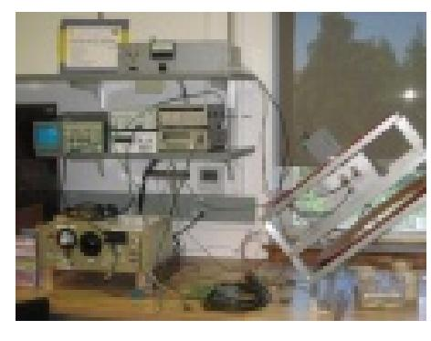
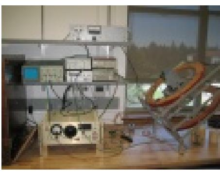
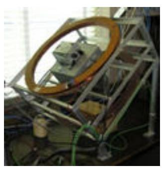
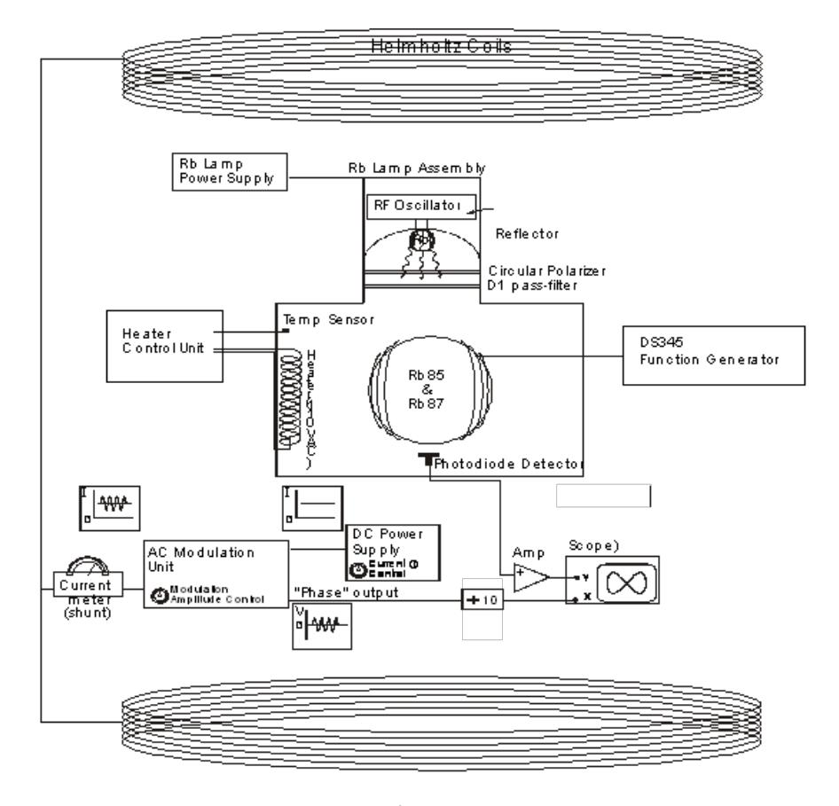
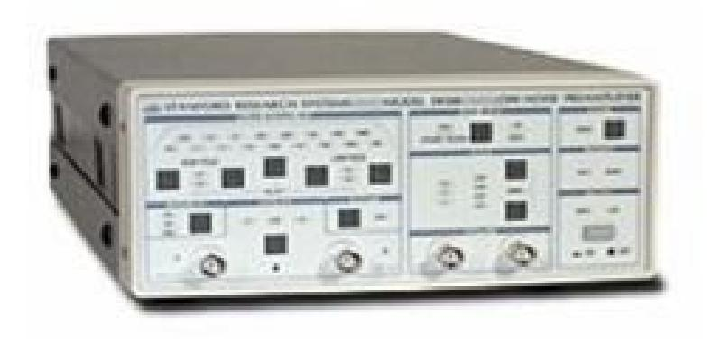
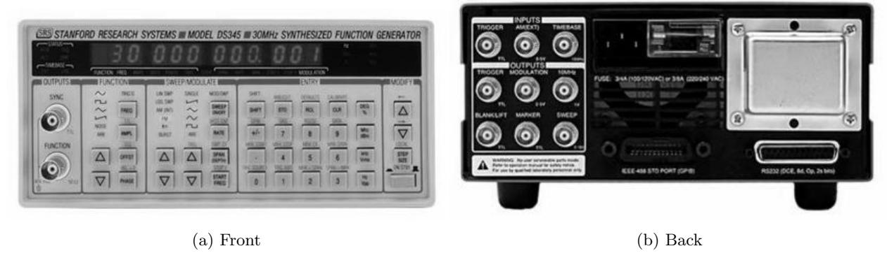
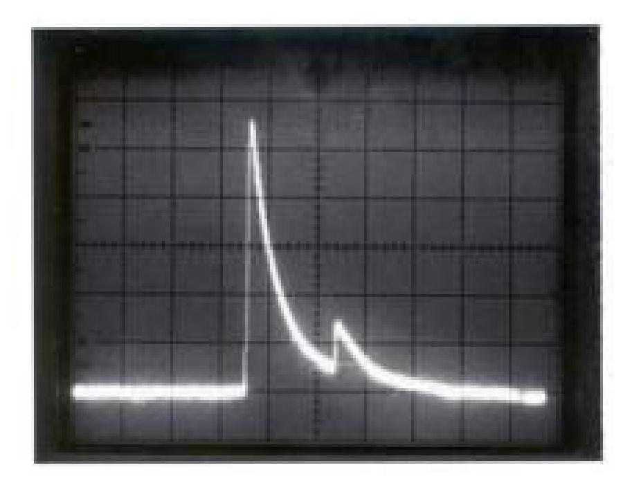
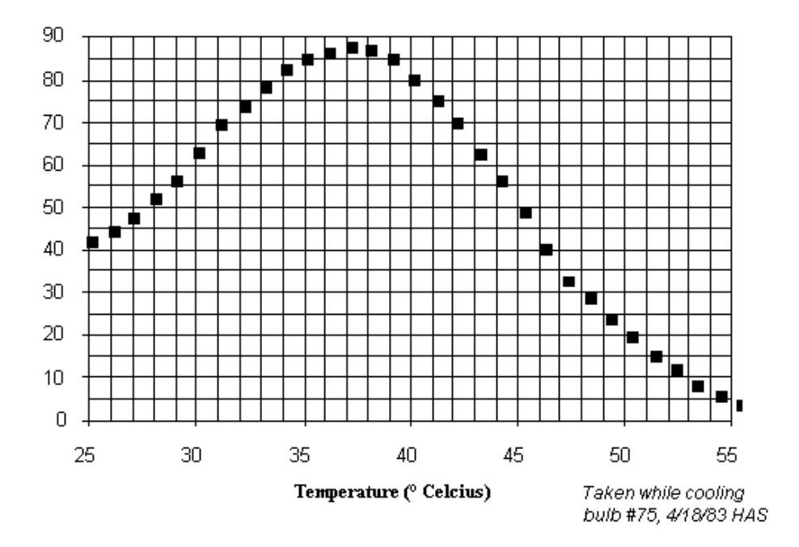

## OPT - Optical Pumping

# Physics 111B: Advanced Experimentation Laboratory University of California, Berkeley

### Contents

| 1 | Introduction                                                                                                                                                                                                                                                                                                                                                                                            | 2                                |
|---|---------------------------------------------------------------------------------------------------------------------------------------------------------------------------------------------------------------------------------------------------------------------------------------------------------------------------------------------------------------------------------------------------------|----------------------------------|
| 2 | Before the first day of lab                                                                                                                                                                                                                                                                                                                                                                             | 2                                |
| 3 | Objectives                                                                                                                                                                                                                                                                                                                                                                                              | 4                                |
| 4 | Background 4.1 Atomic structure  4.2 Rb in a magnetic field: The Breit-Rabi formula 4.3 Optical pumping  4.4 Optically detected magnetic resonance                                                                                                                                                                                                                        | 4 4 5 7 8            |
| 5 | Experimental setup                                                                                                                                                                                                                                                                                                                                                                                      | 9                                |
| 6 | Experimental procedure 6.1 Inspecting and turning on the experiment  6.2 First observation of ODMR: Fixing the current and sweeping the frequency 6.3 Finding good settings for the bulb temperature 6.4 Current modulation/lock-in detection of the resonance frequency  6.5 Timescales for optical pumping using square wave amplitude modulation of the rf field | 12 12 12 14 14 17 |
| 7 | Analysis                                                                                                                                                                                                                                                                                                                                                                                                | 17                               |
|   | References                                                                                                                                                                                                                                                                                                                                                                                              | 19                               |

### 1 Introduction

One of the great early successes of quantum mechanics was its use to describe the structure of atoms and molecules. As is now well-known, the internal structure of atoms and molecules can be described by a set of quantum states. In the case of an atom, these quantum states tell us what is the state of motion of electrons around the nucleus, of the internal spin of those electrons, and also of the internal spin of the nucleus. In the case of molecules, quantum states also tell us about the relative motion of nuclei. Quantum mechanics also tells us which of these quantum states are also states of definite total energy – these are the energy eigenstates.

A powerful way of measuring the energies of atomic quantum states, or, more properly, the energy differences between two energy levels, is through spectroscopy. In many atomic spectroscopy experiments, we start with a collection of atoms that, at any point in time, occupy the various atomic energy states with some probability distribution. We then perturb the atoms with a signal characterized by a single well-defined frequency; in some forms of spectroscopy, several frequencies are used simultaneously. When the signal frequency ν, multiplied by Planck's constant h, matches with an energy difference ∆E between two atomic energy levels, this resonant signal can drive atoms to make transitions between these energy levels. We then employ some means of detecting the changed state distribution of the atomic ensemble, and thereby determine ∆E. From such knowledge, we can learn about the structure of the atom, measure fundamental properties of its constituents, or determine environmental conditions that affect ∆E in known ways.

In this experiment, you will use the phenomenon of optical pumping to prepare an atomic gas in a highly polarized state, and also to detect changes in that polarization when you drive the atoms with a resonant radio-frequency magnetic field. Through this kind of atomic spectroscopy ("optically detected magnetic resonance" (ODMR)), you will verify the structure of the ground states of rubidium, measure the nuclear spin of two rubidium isotopes, and make a precise measurement of the ambient magnetic field in your apparatus.

We hope you will find it remarkable that, in this experiment, quantum mechanics really comes to light. You will notice that several theoretical concepts that you learned about in your courses on quantum mechanics and electromagnetism – quantum numbers for electron orbitals, electronic and nuclear spin, fine and hyperfine structure, optical polarization, conservation of angular momentum, selection rules for atomic transitions, and the energy of magnetic dipoles in magnetic fields – all become tangible and relevant in an experimental setting. You will also gain an appreciation for the accuracy and precision that can be achieved in atomic spectroscopy experiments.

1. Helpful: Physics 137B

2. Days Allotted for the Experiment: 3

This lab will be graded 20% on theory, 30% on technique, and 50% on analysis. For more information, see the [Advanced Lab Syllabus](http://experimentationlab.berkeley.edu/syllabus).

### 2 Before the first day of lab

- 1. Read through this lab description and manual thoroughly.
- 2. Look through the references. The articles by De Zafra [\[1\]](#page-18-1) and Bloom [\[3\]](#page-18-2), while dated, are quite valuable. You will find more references in the [References](#page-18-0) section. Additional references can be found [here](https://experimentationlab.berkeley.edu/sites/default/files/OPT/References/00-OPT_Additional%20References%20and%20Resources_Index.pdf).
- 3. Familiarize yourself with the equipment. A full list with links to manuals can be found [here](https://experimentationlab.berkeley.edu/sites/default/files/OPT/Equipment/00-OPT_Equipment%20List_Index.pdf).
- 4. View the [Optical Pumping Video](https://www.youtube.com/watch?v=v4StxGAhm8Y).

Please note: In order to view the private Youtube videos hosted by the university, you must be signed into your berkeley.edu Google account.

Please note as well: We have become aware of some inconsistencies in the OPT video. These have led students to some misconceptions about the lab and optical pumping. Until we have a chance to redo the video, we ask for your attention to clarifications at a few points in the video.

Time code in Minutes for video in Bold:

- 05:26 The 2P3/2 state splits into F = 3, 2, 1, and 0 (because J = I = 3/2 for 87Rb).
- 06:30 The order of the mF sublevels of the F=1 state has to be reversed (because gF = −1/2).
- 12:34 The ratio of probabilities is not generally 50:50 (it depends on the specific sublevels involved), but this does not make too much of a difference for the discussion.
- 13:05 In the OPT experiment, the atoms are actually pumped into an |mF | = 2 sublevel of the F = 2 state (in the case of 87Rb).
- 14:53 One might say it is wrong to call radio-frequency radiation "light".
- 18:02 It is incorrect to label the horizontal axis "t".
- 20:22 The filter that removes the D2 radiation is not there to get rid of noise. In fact, if one removes the filter, while the same ground state will be pumped, the pumping, however, will not result in the rubidium vapor becoming transparent. This is a finer point of the experiment (of which there are many, most of them being glossed over).
- 5. Review your knowledge of error analysis by viewing the [Error Analysis video](https://www.youtube.com/watch?v=jR54387Wd6c) and [Error Analysis](http://experimentationlab.berkeley.edu/EAX) [Notes](http://experimentationlab.berkeley.edu/EAX).
- 6. Read through this lab description and manual again! And this time, look for all the Questions left for the student. These questions are all in boldface, and are labeled Q1, Q2, etc. You should work out the answers to all of these questions, potentially with your partner(s). You should then be prepared to answer them all in your pre-lab and mid-lab discussion. You may choose also to include some relevant parts (and only the relevant parts!) or your answers in your laboratory report.
- 7. Go over the pre-lab questions at an appointment with the teaching staff; see below.
- 8. Make sure you have a lab notebook and use it when performing the experiment. Don't just use a collection of scraps of paper (yes, we've seen this... doesn't turn out well). The notebook should contain a detailed record of everything that was done and how/why it was done, as well as all of the data and analysis, also with plenty of how/why entries. This will aid you when you write your report.

Before starting the labwork for this experiment, you are required to answer several questions that confirm your understanding of the experimental setup and of the physics concepts underlying the experiment. For this, you will meet with a member of course teaching staff for a pre-lab meeting, where you and your lab partner will discuss these questions and present your answers. Take this opportunity to learn new topics and to engage in open discussion with the teaching staff. The teaching staff member (faculty or graduate student instructor) must confirm that you have answered the pre-lab questions satisfactorily before you can proceed.

In addition, in the midst of your work, you will be required to answer an additional set of mid-lab questions. These are meant to check on your progress and to give you an opportunity to clear up any questions you have about the lab. You will find these mid-lab questions here in the same document as the prelab questions on bcourses. Again, you and your partner will need to make an appointment with teaching staff and answer the mid-lab questions satisfactorily in order to complete the lab.

We will use the gradesheet on bcourses to keep track of whether students have completed the required preand mid-lab reviews for each lab. If you find that the bcourses gradebook is not up to date, be sure to follow up with a member of the instructional staff.

### 3 Objectives

- Observe and understand optical pumping of rubidium atoms
- Observe resonant transitions among Zeeman levels in the atomic electronic ground state
- Observe aspects of the hyperfine and Zeeman structure of alkali atoms, and confirm predictions of the Breit-Rabi equation
- Observe different resonances for the two rubidium isotopes, 85Rb and 87Rb, and determine their nuclear spin
- Measure the ambient magnetic field in the experimental apparatus
- Observe zero-field transitions
- Observe Rabi oscillations
- Measure timescales for optical pumping
- Practice how to extract information from data in robust manner and how to assess statistical and systematic uncertainties

### 4 Background

### 4.1 Atomic structure

Rubidium is an alkali-metal atom with atomic number 37. It comes naturally in two isotopes: the more abundant 85Rb, and the less abundant 87Rb.

In the electronic ground state of Rb, 36 of the 37 bound electrons form a closed inert shell, while the remaining valence electron occupies the 5s atomic orbital. In the first excited electronic state of Rb, which lies about 1.6 eV above the ground state, that valence electron is promoted to the 5p orbital.

Looking more closely, the Rb atom contains three forms of angular momentum: electron orbital angular momentum, electron spin, and nuclear spin. These angular momenta are characterized by the angular momentum quantum numbers L, S and I, respectively. Considering the states above, the orbital angular momentum of the atom is contained entirely in the valence electron, because the other 36 electrons fully occupy their energy shells. So, for the 5s ground state we have L = 0, while for the 5p excited state we have L = 1. The electron spin in both cases is S = 1/2, representing the spin of the single valence electron. The nuclear spins turn out to be different for the two isotopes: I = 5/2 for 85Rb, and I = 3/2 for 87Rb.

The presence of this angular momentum enriches the atomic structure. For example, the 5s electronic ground state is now actually comprised of (2S + 1) × (2I + 1) states (so 10 states for 85Rb and 8 for 87Rb), which correspond to different orientations of the electron and nuclear spin. Similarly, the 5p electronic excited state is now comprised of (2L + 1) × (2S + 1) × (2I + 1) states (30 for 85Rb, 24 for 87Rb).

Further, the different types of angular momentum in the atom are coupled to one another. You should know, and be prepared to explain, what is the physical cause of this coupling.

As a result, the many angular momentum states discussed above are not all degenerate; rather, they are separated by energy differences that are much smaller than the eV-scale energies of electronic excited states. As you should recall from your quantum mechanics courses, the origin of these interactions is somewhat complex. However, because of a clear hierarchy of energy scales in these interactions, and drawing on the lessons of perturbation theory, the net effect of these interactions is simple to describe.

The first-order correction to atomic structure is the fine energy splitting, which comes about because of relativisitic effects that couple the electronic orbital angular momentum to its spin. We can describe these splittings by considering the effect of a Hamiltonian of the form Hf ∝ L · S. You should be able to show that the energy eigenstates of this Hamiltonian are states with a definite total electronic angular momentum J = L + S. The fine-structure splitting introduced by Hf separates the 5p electronic excited state into two terms: the 2P3/2 term and the 2P1/2 term, where, here, we use the nomenclature 2S+1LJ to denote the value of the angular momentum quantum numbers S, L, and J in these terms. There is no fine-structure splitting of the 5s electronic ground state (can you explain why? ).

The fine structure splitting of the excited state is on the order of 0.04 eV. This splitting affects the optical spectrum of Rb. Transitions from the electronic ground states to states within the 2P1/2 term occur with the optical wavelength λD1 = 795 nm, and those to states within the 2P3/2 term occur with the optical wavelength λD2 = 780 nm. These wavelengths lie in the near infrared spectrum. They are only barely visible to the naked eye as a deep red color, giving rubidium its name. The 795-nm transition is labelled as the D1 line and the 780-nm transition as the D2 line of the rubidium spectrum. These labels were assigned by Fraunhofer who detected and labeled the analogous transitions in atomic sodium (another alkali metal) when observing the spectrum of sunlight.

The next-order corrections are known as the hyperfine structure. These corrections come about because of interactions between the electronic angular momentum and the nuclear spin. Because the magnetic moment of the nucleus is so much smaller than that of the electron (about 104 times smaller, similar to the ratio of the electron to proton mass), so too is the hyperfine structure many orders of magnitude smaller than the fine structure splitting.

In the absence of an applied magnetic field, rotational symmetry implies that the energy eigenstates of an atom must also be eigenstates of the total angular momentum of the atom. We denote this total angular momentum as F = I + J. Thus, without having to look further into details, we can foresee already that the ground and excited terms of the atom will split up into manifolds of states, each of which has a well defined total angular momentum quantum number F.

Consider the example of the ground term[1](#page-4-1) of 87Rb. For this term, J = 1/2, while I = 3/2. Following the rules for the addition of angular momentum, we know that the total angular momentum quantum number can have the values F = 1 and F = 2. If you examine the atomic structure of 87Rb, shown, for example, in Ref. [\[2\]](#page-18-3), you see indeed that the electronic ground state of 87Rb consists the low-energy F = 1 state and the higher-energy F = 2 state, separated by an energy of Ehf s = h × 6.8 GHz. Ref. [\[2\]](#page-18-3) also shows the hyperfine structure of the 2P1/2 and 2P3/2 excited states. Make sure that you are able to explain that hyperfine structure also. (Can you explain why the hyperfine structure in the P-states is smaller than in the S-states?)

#### 4.2 Rb in a magnetic field: The Breit-Rabi formula

Now, let us get more quantitative. For illustration, we will consider the specific case of the ground electronic term of 87Rb, but, note that the treatment here can be extended easily to the excited states of 87Rb and also to the states of 85Rb.

As discussed previously, this term contains 8 distinct (linearly independent) quantum states that correspond to the different orientations of the electron angular momentum and the nuclear spin. In order to identify these states, let us recall that the operators J 2 , I2 , Jz, and Iz all commute with one another; here, we have picked out a direction in space to be the z axis, and defined Jz and Iz as projections of the angular momentum operators onto this axis. We can now label the eight states |J, I; mJ , mI i as basis states that span the electron ground states of 87Rb. Following the algebra of angular momentum operators, the magnetic quantum numbers run over the ranges mJ ∈ {−1/2, 1/2} and mI ∈ {−3/2, −1/2, 1/2, 3/2}. This choice of basis can be called the "separable basis.", i.e. the basis states correspond to products of the angular momentum eigenstates of the atom's shell and the nucleus, respectively.

An alternate choice of basis is the "coupled basis." Here, we specify states according to their total angular

1Note, the term "term" refers to all quantum states that have the same "term symbol." Here, that term symbol is a 2S1/2, where the label a tells us it's the lowest-energy electron configuration with that even parity state. The use of the word "term" here is anachronistic, referring back to the early days of atomic spectroscopy where the existence of quantum states was not yet known, and where energies were just terms in a formula that described the spectrum of an atom.

momentum F = J + I, and its projection Fz, using the notation |J, I; F, mF i. Recall that, in this case, F can have the values F = 1 and F = 2, while mF runs over the range {−F, −F + 1, ...F}. You should confirm that, again, we identify eight basis states.

Now we wish to describe the energy eigenstates and eigenvalues of the atom, both in the absence and in the presence of a magnetic field. For this, we consider the effect of the hyperfine Hamiltonian Hhfs that acts on the state space described above. The hyperfine Hamiltonian has the following form:

$$H_{hfs} = -\boldsymbol{\mu}_I \cdot (\mathbf{B}_J + \mathbf{B}_{ext}) - \boldsymbol{\mu}_J \cdot \mathbf{B}_{ext} \tag{1}$$

In this expression, we introduce the magnetic dipole moments of the electrons (µJ ) and of the nucleus (µI ), where we use the convention that boldfaced symbols are vectors.

The atomic electrons and the nucleus are gyromagnets, meaning that their magnetic moment is proportional to their angular momentum. For the electrons, the proportionality is expressed as

$$\boldsymbol{\mu}_J = g_J \mu_B \mathbf{J},\tag{2}$$

where

$$\mu_B = \frac{e\hbar}{2m_e} \tag{3}$$

is the Bohr magneton (e is the electron charge, and me is the electron mass), and gJ is the Land´e g-factor. The Land´e g-factor depends on the angular momentum quantum numbers L, S and J, and it summarizes how the electron orbital angular momentum and spin, which each have different g-factors, are coupled to each other to yield a net magnetic moment.

Similarly, the nuclear magnetic moment is given as

$$\boldsymbol{\mu}_I = g_I \mu_N \mathbf{I} \tag{4}$$

where µN is known as the nuclear magneton, and is defined as

$$\mu_N = \frac{e\hbar}{2m_p} \tag{5}$$

where mp is the proton mass.

Looking at Eq. [\(1\)](#page-5-0) more closely, we see it contains two types of terms. First, there is the intrinsic term −µI ·BJ ≡ AhI·J [\[6\]](#page-18-4). This term summarizes the coupling within the atom between the nuclear and electronic angular momenta. Details of how this coupling term is calculated are given in various texts, including in Ref. [\[6\]](#page-18-4), which reviews experimental data on the hyperfine structure of alkali atoms. A simple description is that this term quantifies the energy of the nuclear magnetic dipole when placed within the internal magnetic field BJ produced by the atomic electrons at the location of the nucleus. Practically, we just accept that this term exists, and that the hyperfine coupling constant A has been measured and tabulated.

Next, there are the extrinsic terms − (µI + µJ ) · Bext that describe the energies of the atomic magnetic dipoles placed within an externally applied magnetic field Beff.

#### Questions left for the student regarding atomic hyperfine structure:

- Q1. In the case that the external magnetic field is zero, what are the atomic energy eigenstates and their energies in the 2S1/2 electronic ground state, and also in the 2P1/2 and 2P3/2 electronic excited states, both for 85Rb and for 87Rb? Here, we are just interested in the energies determined from the hyperfine splitting Hamiltonian Hhfs = hAI · J, i.e., those measured with respect the atomic energy in the absence of hyperfine coupling. You should leave your answer in terms of the hyperfine coupling constants A, which are different for the two isotopes and for the ground and excited states.
- Q2. Now look up the accepted values for those hyperfine coupling constants A (see Table IX in Ref. [\[6\]](#page-18-4)), and then, using your expression determined above, calculate the hyperfine

energy splitting in the ground electronic states of both elements. Compare your answer to known values of this energy splitting; these are found in many places, but let us guide you specifically to Daniel Steck's nice write-ups on 85Rb [\[7\]](#page-18-5) and 87Rb [\[8\]](#page-18-6), which you can find at <https://steck.us/alkalidata/>. You should take note also of the magnitude of the excited state hyperfine splittings. For the 2P3/2 excited state, these splittings include also effects of the nuclear electric quadrupole moment.

- Q3. From Eq. [1,](#page-5-0) we see that the hyperfine energy splitting in the ground state is of the order of µIBJ, i.e. of the product of the magnitude of the nuclear magnetic moment µI and of the magnetic field generated internally within the atom by the atomic electrons Bext. Having determined the ground-state hyperfine energy, provide an estimate for Bext. For comparison, what is the magnitude of the magnetic field that you will apply in your experiment?
- Q4. Now, we consider the energy eigenvalues determined from Hhfs also in the presence of a non-zero external magnetic field. In the alkali-atom ground level, these energies can be calculated using the Breit-Rabi formula. You should look up the derivation of this formula, and be able to describe the concepts used in its derivation. Specifically for this experiment, we are interested in the low-field limit of this formula, which applies when the Zeeman energy produced by the external magnetic field is very small compared to the hyperfine energy splitting discussed above. Derive the following expression for the energy splitting hν between neighboring Zeeman states in this low-field case:

$$\frac{\nu}{B_{\rm exp}} = \frac{2.799}{2I + 1} \frac{\rm MHz}{\rm G}$$
 (6)

where Bext is the magnitude of the externally applied magnetic field.

#### 4.3 Optical pumping

Our aim in this experiment is to drive and observe the effects of Zeeman transitions in the electronic ground states of rubidium atoms. These are transitions between an initial state |F, mF i and a final state |F, mF ±1i, for which the transition frequency ν is given by Eq. [6,](#page-6-1) which you have, hopefully, just derived.

In general, we detect that these transitions are taking place by measuring a change in the distribution of atoms among hyperfine states. But in order to do, we must first prepare the atoms in an initial state that is spin polarized. Specifically, in this case, we need to prepare the atoms so that the population of atoms in the initial state is much larger than it is in the final state. Such spin polarization is needed because the radio-frequency magnetic field, which you will apply to your atoms, is just as effective driving atoms from the initial state to the final state as it is from the final state to the initial state. If the atoms are not spin polarized, then the redistribution of atoms between initial and final states will have no net effect on the atomic populations, and, thus, we will be unable to tell whether these transitions are taking place.

Consider the distribution of atoms among the atomic internal states that exists naturally within the vapor cells used in this experiment. At thermal equilibrium, the probability of finding an atom in a low-energy state is higher than that of finding the atom in a high-energy state. Specifically, at the absolute temperature T, the probabilities P1 and P2 of finding an atom in states with energies E1 and E2, respectively, are related by the Boltzmann factor

$$\frac{P_2}{P_1} = \exp\left(-\frac{E_2 - E_1}{k_B T}\right),\tag{7}$$

where kB is the Boltzmann factor.

Questions left for the student regarding the thermal distribution of an atomic vapor:

Q5. Considering an atomic vapor of rubidium atoms at a temperature of 40 ◦C, determine the ratio of the population of atoms in the electronic excited state to that in the electronic ground state. You will find that the fraction of atoms in the electronic excited 5p state is very small. This is the reason that light from the rubidium lamp will be absorbed in passing through the vapor cell.

Q6. Considering the same conditions, and focusing now on the hyperfine states of the electronic ground state, what is (1) the ratio of the population of atoms in the higher-energy F = I + 1/2 hyperfine state to that in the lower-energy F = I −1/2 hyperfine state, and (2) the ratio of populations in neighboring Zeeman states? You will find that these ratios are near unity, meaning that, at thermal equilibrium, there is nearly zero spin polarization in an atomic vapor cell.

Optical pumping is a method to generate spin polarization. In this experiment, such pumping takes place by exposing atoms to infrared light with a spectrum that can drive all transitions on the D1 line, and that has circular polarization. Consider that the light propagates in the z direction, and that the circular polarization of the light is left-handed. In this case, the selection rules for electric dipole transitions tell us that the light drives transitions that increase the magnetic quantum number mF by one. Then, when the excited state atom decays, it will spontaneously emit an infrared photon, and in the process may change its magnetic quantum number by ∆mF = {−1, 0, +1} (depending of course on whether ground states with those final values of mF exist). Altogether, through a cycle of absorption and then spontaneous emission, we see that the atoms end up being pumped toward states of larger mF . After very many such cycles, each atom in the atomic vapor, regardless of its initial state, will be pumped to the electronic ground state that has the highest value of mF . For example, in 87Rb, this is the hyperfine state |F = 2, mF = 2i.

This state may or may not be the highest energy hyperfine state. That is, with the conditions above and the same choice of isotope, if the external field Beff points also along the z direction, then, indeed, the |F = 2, mF = 2i state is the highest energy state. However, if we reverse the magnetic field so that it points in the −z direction, but we still label states according to the projection of their spin along the +z direction as before, then, now, the final state for optical pumping is the lowest-energy state among the F = 2 states.

Question left for the student regarding optical pumping in the presence of a transverse magnetic field:

Q7. What is is the steady-state atomic population reached by optical pumping when the magnetic field is oriented orthogonally to the z axis? This is a somewhat tricky question, and a good topic for discussion.

#### 4.4 Optically detected magnetic resonance

A crucial feature of this experiment is that the state reached after many cycles of optical pumping (the "pumped state"), is also a state in which the atom no longer absorbs the light that is performing optical pumping (i.e., it is a "dark state").

Questions left for the student regarding light absorption by an atomic vapor:.

- Q8. The broad spectrum of light emitted by the rubidium lamp spans all transitions on the D1 lines of both rubidium isotopes. Explain why the pumped state is a dark state.
- Q9. What if we had made a different choice in this experiment, and we had filtered the output of the rubidium lamp so that it was still circularly polarized, but that now it contained light that drove all D2 lines of both rubidium isotopes. In this case, is the pumped state a dark state? Explain why.

The fact that the optically pumped state is also a dark state allows us to use optical means to detect a radiofrequency magnetic transition within the atomic vapor. Such a technique is generally known as "optically detected magnetic resonance" (ODMR). The idea is simple: If the atoms are not driven with a resonant radio-frequency magnetic field, then they are all optically pumped into a dark state that no longer absorbs optical pumping light. A photodetector that collects light transmitted through the atomic vapor will read a high light level. In contrast, if we apply a resonant radio-frequency magnetic field, that rf field will drive

Figure 1: Optical Pumping setup. See larger image [here](http://experimentationlab.berkeley.edu/sites/default/files/images/OPT_3524.jpg) Figure 2: Optical Pumping Equipment & Coil. See larger image [here](http://experimentationlab.berkeley.edu/sites/default/files/images/OPT_3548.jpg)

Figure 3: Optical Pumping coils assembly. See larger image [here](http://experimentationlab.berkeley.edu/sites/default/files/images/OPT_Coils_Top_t9743.jpg)

the atoms out of the optically pumped state. This means that, now, the atomic vapor will absorb some of the optical pumping light, and the photodetector will read a lower light level.

### 5 Experimental setup

The experimental setup is described in the [Optical Pumping Video](https://www.youtube.com/watch?v=v4StxGAhm8Y), in the photographs shown in Figs. [1,](#page-8-1) [2,](#page-8-1) and [3,](#page-8-1) and also in the schematic drawing of Fig. [4.](#page-9-0) Let us go over some of this equipment:

• The atomic vapor cell: In the heart of the experiment, there is a few-inch-diameter spherical glass bulb. This bulb is coated with a thin wax coating, and contains a gas which is mostly a low-density neutral buffer gas. It also contains a small amount of rubidium. When the bulb is cold, that rubidium resides mostly on the walls of the glass cell, in a quantity that is so small that the glass is still transparent. When the bulb is heated, some of that rubidium is released into the buffer gas within the optical bulb.

The density of rubidium within the buffer gas is thereby controlled by varying the temperature of the bulb. Such temperature control is achieved using a resistive heater, which is operated by the Heater Control Unit. This control unit is turned on or off based on the temperature read by a temperature sensor. We note that the resistive heater generates a stray magnetic field that interferes with our ODMR measurements. Therefore, when making precise measurements, we choose just to switch off the heater.

Because of collisions with the buffer gas, rubidium atoms diffuse for a long time within the cell before striking the walls. This long lifetime gives enough time for the rubidium atoms to absorb and re-emit many optical pumping photons. The atomic spin is generally conserved in a collision with the buffer gas, so that once an atom is in the pumped state, it will stay there for some time (you will measure how long).

• Optical pumping optics: The optical pumping light is generated by a lamp that contains rubidium gas within an electronic discharge. This is a smart choice: the light emitted by electronically excited rubidium in the lamp is exactly the color of light that ground-state rubidium in the glass cell can absorb! More specifically, the emission from the lamp contains light that can drive all of the D1 and D2 lines for both isotopes of rubidium, and also other rubidium emission lines that are irrelevant to this experiment.

The emission from the lap passes through two optical elements. First, it runs through an optical polarizer that allows light through only if it is circularly polarized. We are unsure whether the emitted light is strictly left-handed or strictly right-handed – but it is one of these two choices! Second, the light runs through a "D1 pass filter." This is an interferometric filter that allows light through only if its wavelength is near 795 nm. This band-pass means that the light passing through this filter can drive

Figure 4: Block diagram of Equipment

all D1 transitions in the vapor cell, but that it no longer contains the spectrum to drive D2 transitions (do you remember why this is important?).

The lamp emission then passes through the atomic vapor cell, and shines upon a photodiode. Details on the photodiode are found here: [Photodiode Data Sheet](https://experimentationlab.berkeley.edu/sites/default/files/OPT/Equipment/OSI%20Optoelectronics_Photodiodes_Datasheet.pdf).

The current in this photodiode is amplified using a SRS SR560 amplifier (Fig. [5\)](#page-10-0). This amplifier is ubiquitous in experimental physics laboratories, and you should review its manual ([SR560 Voltage](https://experimentationlab.berkeley.edu/sites/default/files/General_Equipment/SRS%20SR560_Manual.pdf) [PRE-AMP](https://experimentationlab.berkeley.edu/sites/default/files/General_Equipment/SRS%20SR560_Manual.pdf)) to be familiar with its function. The amplified output is then measured on an oscilloscope.

This optical setup defines an optical axis – call it z. The optical pumping state is the state with maximum angular momentum projection along this axis.

• Radio-frequency coil: The atomic vapor is positioned between two nearby electromagnet coils, which are connected in series, and which are driven by a an SRS DS345 function generator. Again, this function generator (see Fig. [6\)](#page-10-1) is quite ubiquitous in experimental physics labs, and, so, it would make sense for you to learn how to operate it. We suggest strongly you familiarize yourself with the [DS345](https://experimentationlab.berkeley.edu/sites/default/files/General_Equipment/SRS%20DS345_Manual.pdf) [Manual](https://experimentationlab.berkeley.edu/sites/default/files/General_Equipment/SRS%20DS345_Manual.pdf).

The sinusoidal current produced by this SRS DS345 function generator runs through the rf coils, and generates a radio-frequency magnetic field along a direction that is orthogonal both to the optical axis and also to the axis of a strong external magnetic field (see next). This transverse magnetic field has the right polarization to drive Zeeman transitions within the vapor.

• Light-proof box: The vapor cell, heater, optical setup, and rf coils are all located within a light-proof, thermally insulating box. This box allows us to detect the weak optical signal of lamp light that is

Figure 5: SR560 Amplifier

Figure 6: DS 345 Synthesized Function Generator

transmitted through the cell without the interference of room light. The box also keeps the vapor cell at a constant elevated temperature for long enough for us to perform measurements.

• Axial magnetic field: Magnetic fields along the z axis are produced by two large, coaxial, circular coils placed outside the light-proof box. These two coils are in the Helmholtz configuration, which means that the separation d between the coils, and the radius a of the coils, are chosen so as to produce a near-constant magnetic field.

#### Question left to the student regarding Helmholtz coils:

- Q10. Consider two coaxial coils, each with radius a, and with total separation d. Assume the coils are connected in series, so that each carries the same current i running in the same direction through each coil. Let the origin z = 0 be located along the coil axis (z) and midway between the two coils. What is the field Bz(z) along the coil axis?
- Q11. The Helmholtz condition is chosen so that the magnetic field is nearly uniform in the region between the coils. Consider the second derivative d 2Bz/dz2 in the axial field, evaluated at z = 0. Show that d 2Bz/dz2 = 0 when d = a.
- Q12. Now assume that each coil is made up of N turns of wire. Neglecting the wire thickness, so that all the wire in each coils has the exact radius a and separation d between coils, show that the axial magnetic field is given as

$$0.9 \times 10^{-2} \, \frac{Ni}{a} \times \frac{\text{G m}}{\text{A}}.\tag{8}$$

Q13. Even at the Helmholtz condition, the field between the coils is not perfectly homogeneous. Using your expression above for Bz(z), what is the magnetic field at z = 0 and at z = 2.5 cm, where we take the values for the experimental setup as N = 135 turns and a = 27.5 cm? You see that, even under ideal conditions where we neglect all other possible sources of magnetic field inhomogneity, there is a difference between the magnetic field at the center (z = 0) and at the out edge (z = 2.5 cm) of the glass bulb.

These Helmholtz coils are driven by a current source that is the sum of a DC current, produced by a dedicated DC current supply, summed with an AC current. See here for [details of the magnetic](http://experimentationlab.berkeley.edu/sites/default/files/OPT/Circuitformagnetic%20coils.png) [coil circuit](http://experimentationlab.berkeley.edu/sites/default/files/OPT/Circuitformagnetic%20coils.png). This AC current is generated by taking the 60 Hz AC power mains and then reducing its peak-to-peak voltage using a variable transformer. As a result, the magnetic field produced by the Helmholtz coil contains both a DC and a (small) AC component. The same AC voltage, with an additional variable phase shift, is sent to the same oscilloscope that monitors the photodiode signal. As we will see below, the DC current controls the Zeeman resonance frequency ν of the atomic vapor, while the AC current modulation provides a robust, and remarkably precise, method to detect the magnetic resonance condition.

The DC current is measured by running it across a well-calibrated, low-impedance resistor (called a "shunt resistor"), and then measuring the voltage across this resistor. The shunt is a calibrated resistor and is temperature compensated so that its resistance value does not change with a change in temperature (On average the shunt's resistance changes less than 0.002% (or 20 ppm = parts per million) per ◦C of temperature change). The voltage that develops across the shunt is 10 mV per ampere of current through the coils.

### 6 Experimental procedure

#### 6.1 Inspecting and turning on the experiment

Compare the experimental setup to the block diagram (Figure [4\)](#page-9-0). Follow all the connections, and identify what each unit does. Inspect the inside of the light-proof box. Be particularly cautious with the fragile glass vapor cell and with the optical filters. If you feel something needs to be adjusted, ask the teaching staff for help rather than doing it yourself.

When satisfied, turn on all the equipment. Start with the main switch, which is at the lower right-hand corner of the Rubidium Lamp Supply/Coil Driver Panel. Be mindful of some limits: Current in the Helmholtz coil should not be run above around 3 A (can you come up with a reason why?). The temperature of the light-proof box should not exceed 55 ◦C.

Monitor the photodiode signal and turn on the rubidium lamp. The lamp should switch on and emit light that is detected on your photodiode at a current of 25 - 30 mA.

You will adjust the SR560 pre-amplifier at various points in your experiment. But to get started, we advise you to select Input 'A', with the DC/GND/Ac button on the AC position. Set the gain initially to 500, the LF Roll-off to 0.1 Hz, and the HF Roll-off to 10 kHz, with both filters set at 6 dB per octave. (Be sure to play with these settings later on to discover why they are a good starting point!) Pay attention that sometimes the SR560 goes into "overload." To reset the unit, you will need to press the OL REC (OverLoad RECovery) button.

#### 6.2 First observation of ODMR: Fixing the current and sweeping the frequency.

Now we will make our first observation of Zeeman resonances in the two rubidium isotopes. For this, we will apply a DC magnetic field to the vapor cell, which fixes the Zeeman resonance frequencies of the two isotopes. Then, while monitoring the photodiode signal, we will use the DS 345 generator to output an rf frequency that is swept slowly over a wide range of frequencies. Resonances will be observed as changes in the photodiode signal. We will see later on that this is not a particularly precise or accurate way of finding the Zeeman resonances. But this method does provide us with a broad view of what is going on in the experiment.

We first heat up the glass cell to place a substantial number of rubidium atoms into the vapor. Heat the light-proof box to about 50 ◦C.

In the meanwhile, set up the rest of the experiment. We suggest you start with a DC current of 1 A through the Helmholtz coil. Observe not only the reading on the current supply, but, also, measure and write down the DC voltage across the shunt resistor. To set the parameters of the radio-frequency sweep, we should first answer the following questions:

#### Question for the student about Zeeman transition frequencies:

- Q14. Using your formula for the magnetic field produced by the Helmholtz coil, what is the field generated with a i = 1 A current, with N = 135 turns in each coil, and a coil radius of a = 27.5 cm?
- Q15. At this magnetic field, what are the expected Zeeman transition frequencies for 85Rb and for 87Rb?

Note that the total magnetic field on the vapor cell is the sum of the applied magnetic field and the ambient magnetic field in the lab. We might refer to this ambient field as the "Earth's field," although, in fact, the ambient field is the sum of all fields in the lab, i.e. not just that produced by the Earth's core, but also fields produced by rebar in the walls of the building, magnetic materials within the experimental apparatus, etc, and most annoyingly, currents in the power lines nearby.

#### Question for the student about the Earth's field:

- Q16 What is the field produced by the Earth in Berkeley, California? What is its magnitude and what is its orientation?
- Q17 The ambient magnetic field and the field produced by the Helmholtz coils are both vectors. The experimental setup is designed so that these two field vectors are aligned with one another. But nothing's perfect! What effects would a misalignment of the two fields have on your measurements? For example, how would a misalignment affect the how the Zeeman resonance frequency varies with the current i in the Helmoltz coil? Also, if we tune the Helmholtz coil to cancel out precisely the component of the ambient field along the optical axis, what residual field might remain, and what effect would it have?

From your answer to question [Q16,](#page-12-0) you should now have a good guess for the expected Zeeman resonance frequencies.

Set the DS 345 unit so that it will produce a sinusoidal current whose frequency is swept linearly, with a 100 ms sweep period, over a 3 MHz range that spans the expected resonance frequencies. Set the output voltage initially to 5 V peak-to-peak.

We will use the oscilloscope to measure the amplified photodiode signal vs. the frequency of the rf magnetic field. Let us use the oscilloscope's XY mode for this. On the X-axis (Channel 1), we will place the "Sweep Output" of the SRS DS 345 unit. Check that this output indeed produces a triangle wave, whose voltage is proportional to the frequency of the rf output. On the Y-axis (Channel 2), we will place the photodiode signal.

If all goes well, we should now be seeing the ODMR signals! See Fig. [7](#page-13-2) for what to expect.

You may see the resonance frequencies jumping around as the heater in the light-proof box switches on and off (can you explain why?). To avoid this jumpiness, turn off the heater (What other detrimental effects may the heater have on our experiment. For this think about how the heater works).

Let us explore this signal to make several qualitative observations:

- How does the signal vary with current in the Helmholtz coils? Why?
- You should see two resonances. Which corresponds to which isotope? What can you observe about the isotopic abundances in your glass cell?

Figure 7: Amplified photo diode signal with large span frequency modulation.

- How does the resonance signal vary with assorted parameters, such as the sweep period, the rf voltage, settings of the photodiode amplifier, current in the rubidium lamp, etc.? You should quiz yourself: Do you understand why all these variations come about? This is an essential part of experimental physics: verifying that you have a qualitative understanding of your apparatus and the underlying physics, and gaining a finer sense of how your measurements results vary with and may depend on various parameters so that you can convincingly assess all sources of error.
- How precisely can you determine the resonance frequency by this method? Here, you might play around with more settings to improve your measurement.For this it is important to understand where the asymmetric shape of the signal comes from.

#### 6.3 Finding good settings for the bulb temperature

With the ODMR signal of the two isotopes in view on the oscilloscope, increase the light-proof box temperature to around 50 ◦C. Then turn off the heaters. Over time, the temperature of the light-proof box will slowly drop. While this is happening, take measurements of the height of the ODMR signals for each isotope vs. the box temperature. You may obtain a curve similar to that of Fig. [8.](#page-14-0) Note that the data in the Figure were taken long ago with a different vapor cell. So, do not be too concerned if your data are different than those in the Figure.

You should be able to explain the rough features of your data. These data will also guide your choice of temperature for the measurements to follow.

#### 6.4 Current modulation/lock-in detection of the resonance frequency

As explained in the introduction video and in some of the key references for this experiment, a quicker, more accurate, and more precise method for finding the Zeeman resonance frequency is to modulate the Helmholtz current while applying a single-frequency rf field[2](#page-13-3) .

2Alternately, you could consider fixing the Helmholtz current and modulating the rf frequency. However, this approach has the downside of competing against 60 Hz variations in the magnetic field from power-line noise. By modulating the current

Figure 8: Optical signal amplitude vs. Temperature for Rubidium 85.

The essential idea here is that of lock-in detection. Let us first consider a slow and difficult method to detect the Zeeman resonance. Say we observe the DC level of the photodiode, turn on the rf field at a single frequency, and then slowly change the current in the Helmholtz coil. When we are away from the resonance condition, the photodiode output will be high (careful: your voltage signal might be inverted depending on the direction of the photocurrent and amplifier settings). When we strike the resonance condition, the photodiode output will be low. By carefully tuning the current and identifying the minimum photodiode output, we find the resonance condition as precisely as we can.

This method is slow: We have to slowly vary the current until we find the center of the resonance signal. Even worse, this method is prone to low-frequency noise: During our procedure, the photodiode signal strength, which we are measuring essentially as a DC signal, will drift. This drift occurs for many reasons: variations in the rubidium lamp intensity, temperature changes in the vapor cell, slow changes in the amplifier gain, drifts of the ambient magnetic field (e.g. when somebody moves a magnetic stool or screwdriver in the lab), etc. Indeed, the longer the time over which we perform our measurement, the more types of noise sources enter into our measurement.

Lock-in detection involves applying a modulation to the experimental apparatus at "high" frequency, and then measuring specifically the variation of a measured signal at the modulation frequency. This lock-in detection method has two enormous advantages over the slow DC approach described previously. First, the lock-in method detects an AC signal rather than a DC signal. We then benefit from the fact that experimental noise is typically lower at high frequency than it is at low frequency, essentially because many causes of noise occur at low frequency but fewer of them occur at low frequency. In this experiment, we choose 60 Hz as our modulation frequency. While this is not a particularly "high" frequency, it is handy to generate, and, moreover, a 60 Hz modulation in the magnetic field produced by the power mains already

instead, precisely in sync with the 60 Hz power lines, we make it that the 60 Hz magnetic field noise just adds to our modulation and does not obstruct our measurement

exists in the lab. Might as well ride the wave[3](#page-15-0) !

Second, our lock-in detection naturally allows us to take derivatives of the photodiode signal vs. current. That is, by modulating the current, we are constantly scanning across the Zeeman resonance signal. By examining the signal variation that is synchronous with our current modulation, we can quickly, precisely, and accurately locate the center of the resonance response.

To implement this method, we turn on the field modulation by flipping the "Field" switch on the Coil Driver panel, and also turn on the "Phase Out" output by flipping the "Phase Switch." The Phase Out signal tracks the 60 Hz modulation placed on the Helmholtz coils. We record this on the X-axis (Channel 1) of our oscilloscope, while still recording the amplified photodiode voltage on the Y-axis (Channel 2).

Let us begin by finding the Zeeman resonance under this method. From our previous ODMR work, we have a first mesurement of the Zeeman resonance frequencies at a 1.0 A DC field. We will find each of these resonances: (1) set the rf function generator to the estimated resonance frequency (with no frequency modulation), and then (2) finely tune the DC current around 1.0 A until the resonance is observed. Repeat for each isotope.

Questions left for the student regarding lock-in resonance detection:

- Q18. What should the lock-in signal on the scope look like when we are exactly on resonance? Do we expect any symmetry in the signal, and if so, how should it be symmetrical? What should it look like if we are just slightly off resonance?
- Q19. How should the signal vary as we change (1) the magnitude of the 60 Hz modulation, (2) the density of rubidium in the cell, (3) the peak-to-peak amplitude of the rf signal? Under what conditions will our measurement be most precise?

In this laboratory we are interested in measuring the magnetic moment of the Rubidium atoms as well as determining the background magnetic field. In experimental physics it is usually a good idea to explore a few options to make measurements. This will help us greatly to identify major problems as well as to estimate how reliable our measurements are.

Thus, we will record the resonances not only for one magnetic field value, but for many, including the special case where it should vanish. Further, we will flip the sign of the magnetic field and record data for both isotopes.

Thus we plan on recording the following data:

- A resonance frequency vs. current data scan. This should be measured both for 85Rb and 87Rb, and also should be recorded for both forward and backward current through the Helmholtz coil. While making these measurements, we should continually ask: What is the accuracy of my measurement? What is the precision? How can I estimate these quantities? We might find that we want to use different parameters for measurement at high current vs. low current, or for one isotope vs. the other. We should be vigilant for anything that might influence and bias our measurement. Our measurements might be "heteroscedastic," meaning that the estimated error is not constant across the dataset, but, rather, varies from point to point. Also, we should spot-check our data as they are gathered, in order to catch any mistakes that might require us to retake data. One warning: don't confuse a 85Rb signal for a 87Rb and visa versa.
- Measurements of the Zeeman resonance frequency at zero DC current. This resonance frequency is a direct measurement of the ambient magnetic field in the laboratory. Let's see how constant our measurements are in time, and whether they vary systematically for any reason.
- Observation of a zero-field resonance: For this, let's turn off the rf modulation altogether, and then scan the current i. We'll find there still exists a resonance feature that occurs when the Helmholtz field exactly cancels the ambient field along the optical axis. You should (1) explain why this resonance

3Ok, this view is a little naive. There are other sources of disturbance that are also synchronized to 60 Hz, and these might, in fact, bias our measurement. Can you think of any such sources?

occurs, and (2) use this resonance as another way to measure the strength of the ambient field (you'll comment later on its precision and accuracy).

One important consideration is how much data and which data should we take. For instance, what currents and what step-size should we choose? What parameters should we record? This question is usually difficult to answer before doing the experiment. Thus, we suggest ask yourself first the following questions:

- What are the largest (smallest) values I can (safely) use? Often we learn most in the extreme regimes
- At which values do I expect the most interesting signatures? What step size do I need to choose to make sure that I do not miss a feature (such as a resonance)?

Usually, it is a good idea to do a pilot measurement before taking the actual data. This will inform you whether the apparatus works as expected, where interesting features are and how large they are, gives already hints about potential problems. This should give you then sufficient information to plan your actual data taking, i.e., to determine which range to scan over, how much data to collect as well as the step-size to obtain sufficient precision.

#### 6.5 Timescales for optical pumping using square wave amplitude modulation of the rf field

Here, we will make some time-domain measurements in order to characterize the timescales of optical pumping and of Zeeman transitions.

Recall a setting (rf frequency, current, current polarity) you found previously for a strong Zeeman resonance. Set the rf-generator to output an amplitude modulated sinusoidal signal, where the amplitude modulation is a square wave (on/off) at a low frequency (say in the few Hz range), while the sinusoidal signal is at the rf resonance frequency. Observe the amplified photodiode signal as a time-trace on the scope, with the scope triggered synchronously with the amplitude modulation.

You should see that (1) when the rf magnetic field is off, the gas becomes optically pumped and transparent, and (2) when the rf magnetic field is switched back on, the atomic spins are rotated away from the pumped state and the gas becomes opaque.

What is the "pumping time" (1/e) for the non-pumped gas to become optically pumped? What is the "relaxation time" for the rf-driven gas to arrive at its new steady state?

If we zoom in, we may be able to see signs of coherent Rabi oscillations. These occur when the optical pumped atomic spins are suddenly subjected to an rf magnetic field. In response, the atomic spin should rotate cyclically away from the pumped state and then back. You should be able to explain this phenomenon clearly based on your studies of magnetic resonance, e.g., in your quantum mechanics or electromagnetism courses. This Rabi oscillation is damped for several reasons, including spin-relaxation in collisions, spinrelaxation upon striking the wall of the glass cell, magnetic field inhomogeneity, and light scattering.

### 7 Analysis

(See [Error Analysis Notes](http://experimentationlab.berkeley.edu/EAX) for further discussion.)

The main aims of our data analysis are to determine the nuclear spin values of the two rubidium isotopes, to verify the Breit-Rabi formula, and to determine the ambient magnetic field. We recommend the following procedures.

1. Make plots of frequency vs. current applied to the Helmholtz coils to help you analyze your data. You should have four sets of data (two isotopes, two polarities) and four lines when you plot them. The individual points, the slopes of the curves, and their axial intercepts have an interrelated significance. Note that, whether your rf drive is driving a Zeeman transition that decreases the energy of the atom (with the external magnetic field oriented in one direction), or increases the energy of the atom (with the external magnetic field oriented in the opposite direction) you will still read a positive frequency on your rf function generator. That is, because the rf field is linearly polarized, the resonance condition will be hν = |∆E| where ∆E is the energy gained by the atom. Given this fact, how should you plot your data?

Also, recall that the magnetic field is a vector quantity. Your Helmholtz coil produces a field only along one axis, while the ambient magnetic field, in principle, can be oriented along a slightly different axis. How should you account for this fact in your data analysis?

2. Think about what model (=fit function) describes the frequency vs. current relationship best. How can you quantify how good this model fits the data? Please see the EAX for methods to decide whether something is a good fit, especially the χ 2 method.

In this experiment the errors on the data points tend to be too small to be visible when plotting the data. Furthermore, often the fit fits the data so well that it looks like it is a perfect fit. In order to make the discrepancies visible and assess the quality of the fit, we recommend plotting also the residuals, i.e. yi − f(xi) where yi is the measured data point, f is the fit function and xi is the independent variable at which the data yi was taken. As the error on the residual use only the error from yi .

To analyze the data more efficiently it might be best to combine positive and negative polarities.

Crucially, your data fitting should also account for errors. One approach is to use the error estimates that you derived for each data point in your data set as weights within your linear regression formulae. Another approach is to let all your data have equal weight and then to estimate errors based on residuals to your linear fit (again, see Ref. [\[5\]](#page-18-7)). Do the fit results and error estimates using these two methods agree with one another? If they do not, explain why this might be the case. Again, we are not looking for excuses or for you to tune your experimental findings. Just be honest and give your best-reasoned answer.

3. Determine the nuclear spins of 85Rb and 87Rb:

You are asked to pursue two approaches. First, you will analyze your data to determine the ratio ν85/ν87 between the Zeeman resonance frequencies of the two isotopes at the same magnetic field. You have two equations to work with; one is the Breit-Rabi equation (Eq. [6\)](#page-6-1), and the other is the magnetic field of the Helmholtz coils as a function of current (Eq. [8\)](#page-10-2). Write down the equations, rearrange them, see how the two isotopes fit in, see how additions or subtractions can help, use both + and − currents. Keep in mind that the magnetic field in the Breit-Rabi equation is the sum or difference of the magnetic field of the Helmholtz coils and the Earth's field. From Eq. [\(6\)](#page-6-1) we have a relation between the Zeeman resonance frequency ν85 and the nuclear spin quantum number I85 for the 85Rb isotope, and, similarly, between ν87 and I87 for the 87Rb isotope.

From your data determine the best ratio ν85/ν87. Given that your resonance frequency measurements for the two isotopes were likely not performed at exactly the same external magnetic field, you should extract this ratio by fits to your overall data set. Think through how this should be done, and which sources of error are either retained or eliminated by your analysis method. From this ratio, deduce the values of I85 and I87. Their true values are exactly half-integral. Are the ratio, and this half-integral expectation, sufficient to determine both nuclear spins?

Second, the relation you obtained that combines Eqs. [6](#page-6-1) and [8](#page-10-2) should allow you to determine I85 and I87 individually, directly from linear fits to your data sets. Do this. Now consider the result: What statistical and systematic errors are there in this method of determining the nuclear spin? Are your measurements consistent with known values?

Here's an important lesson: It is absolutely not your job as an experimentalist to tune your error estimates to the point where your measurements are consistent with your expectations! Your error estimates are based on your best evaluation of all aspects of your measurement. If your error estimates are either very much smaller or very much larger than the difference between your measurement outcome and the expected theoretical value, that's just how it is! Do not try to cover up this discrepancy! Rather, it is then your job to interpret this difference: Is it possible that you over/under estimated your errors? Explain how. Is it possible that your theoretical prediction is wrong?

- 4. Having now determined the values of the nuclear spins use Eq. [\(6\)](#page-6-1) to determine the value of B at the bulb for one positive and one negative value of the current in the coil. Compare these values with those calculated from the coil dimensions and current. What is the accuracy of each of these values? There are many effects for you to consider: the accuracy of our knowledge of the Bohr magneton µB, possible errors from neglecting the nuclear Zeeman energy, the accuracy of describing the Helmholtz coils as coils of precisely defined and known radius and position, the accuracy of the shunt resistor and other parts of the measurement apparatus, etc.
- 5. Determine the magnitude of the ambient ("Earth's") magnetic field:

You should compare two approaches: First, you have previously made measurements of the Zeeman resonance frequency with zero DC current in the Helmholtz coils. Describe how these measurements provide a measurement of the ambient field strength, and present your results and your estimated error in these results.

Second, you can determine the ambient magnetic field by considering the linear fits performed earlier to your data sets. Explain how this is done, and obtain the results. Depending on how you analyzed your data, you will have either two or four measured values of the ambient field. You should have an independent estimate of the error in each of these results.

Now compare these various measurements of the ambient magnetic field. Are they consistent with each other? That is, are the variations between measured values consistent (either too large or too small) with your estimated errors? Is one method more precise or accurate than another method? Explain.

- 6. Explain why there is a resonance at zero field, i.e. when the total magnetic field along the Helmholtz-coil axis, being the sum of the Helmoltz field and the ambient field, is zero.
- 7. What do you need to know and take account for, in order to make a rough estimate or calculation of the pumping time to compare with your experimentally measured value?

Last day of the experiment please fill out the [Experiment Evaluation](http://experimentationlab.berkeley.edu/StudentEvaluation).

### References

- [1] R.L. De Zafra, "[Optical Pumping](https://experimentationlab.berkeley.edu/sites/default/files/OPT/References/05-Optical_Pumping-DeZafra.pdf)", Amer. Journ. of Phys. 28, 646 (1960). #QC1.A4
- [2] Reference Rubidium Diagrams [Rb Energy Levels](https://experimentationlab.berkeley.edu/sites/default/files/OPT/References/RbEnergyLevels.pdf)
- [3] A.L. Bloom, "[Optical Pumping](https://experimentationlab.berkeley.edu/sites/default/files/OPT/References/02-Optical_Pumping-Bloom.pdf)", Scientific American, October 1960, p.72. #T1.S5
- [4] N.F. Ramsey, [Nuclear Moments](https://experimentationlab.berkeley.edu/sites/default/files/OPT/References/04-Nuclear_Moments.pdf), Wiley, 1953. #QC174.1.R31. Advanced treatment.
- [5] L. Lyons, [A Practical Guide to Data Analysis for Physical Science Students](https://experimentationlab.berkeley.edu/sites/default/files/EAX/Lyons_A%20Practical%20Guide%20to%20Error%20Analysis.pdf), Cambridge, 1991. #QC33.L9
- [6] Arimondo, E., et al. "[Experimental determinations of the hyperfine structure in the alkali](https://experimentationlab.berkeley.edu/sites/default/files/OPT/References/RevModPhys.49.31.pdf) [atoms](https://experimentationlab.berkeley.edu/sites/default/files/OPT/References/RevModPhys.49.31.pdf)", Reviews of Modern Physics 49, 31 (1977).
- [7] Daniel Steck, ["Rubidium 85 D Line Data,](https://experimentationlab.berkeley.edu/sites/default/files/OPT/References/rubidium85numbers.pdf)" online at <https://steck.us/alkalidata/>.
- [8] Daniel Steck, ["Rubidium 87 D Line Data,](https://experimentationlab.berkeley.edu/sites/default/files/OPT/References/rubidium87numbers.pdf)" online at <https://steck.us/alkalidata/>.
- [9] Detailed description of an optical pumping experiment. Important derivation in appendix. "[Electron](https://experimentationlab.berkeley.edu/sites/default/files/OPT/References/06-Experiment_7.pdf) [Spin Resonance by Optical Pumping](https://experimentationlab.berkeley.edu/sites/default/files/OPT/References/06-Experiment_7.pdf)."
- [10] [Additional References and Resources](https://experimentationlab.berkeley.edu/sites/default/files/OPT/References/00-OPT_Additional%20References%20and%20Resources_Index.pdf)
- [11] [List of OPT Equipment and Manuals](https://experimentationlab.berkeley.edu/sites/default/files/OPT/Equipment/00-OPT_Equipment%20List_Index.pdf)