# **OPTICAL PUMPING OF RUBIDIUM OP1-B**

# **Guide to the Experiment**

# A PRODUCT OF TEACHSPIN, INC.

TeachSpin, Inc. 2495 Main Street Suite 409 Buffalo, NY 14214-2153 (716) 885-4701 phone/ (716) 836-1077 fax or [www.teachspin.com](http://www.teachspin.com/)

## Table of Contents

| SECTION |                 |                                                     | PAGE |
|---------|-----------------|-----------------------------------------------------|------|
| 1.      | Introduction    |                                                     | 1-1  |
| 2.      | Theory          |                                                     |      |
|         | A.              | Atomic structure of alkali atoms                    | 2-1  |
|         | B.              | Interaction of an alkali atom with a magnetic field | 2-4  |
|         | C.              | Photon absorption in an alkali atom                 | 2-8  |
|         | D.              | Optical pumping in rubidium                         | 2-11 |
|         | E.              | Zero field transition                               | 2-14 |
|         | F.              | Rf spectroscopy of 85Rb and 87Rb                    | 2-15 |
|         | G.              | Transient effects                                   | 2-17 |
| 3.      | Apparatus       |                                                     |      |
|         | A.              | Rubidium discharge lamp                             | 3-1  |
|         | B.              | Detector                                            | 3-3  |
|         | C.              | Optics                                              | 3-5  |
|         | D.              | Temperature regulation                              | 3-10 |
|         | E.              | Magnetic fields                                     | 3-13 |
|         | F.              | Radio frequency                                     | 3-18 |
| 4.      | Experiments     |                                                     |      |
|         | A.              | Absorption of Rb resonance radiation by atomic Rb   | 4-1  |
|         | B.              | Low field resonances                                | 4-6  |
|         | C.              | Quadratic Zeeman Effect                             | 4-12 |
|         | D.              | Transient effects                                   | 4-17 |
| 5.      | Getting Started |                                                     | 5-1  |

# Section 1

# INTRODUCTION

The term "optical pumping" refers to a process which uses photons to redistribute the states occupied by a collection of atoms. For example, an isolated collection of atoms in the form of a gas will occupy their available energy states, at a given temperature, in a way predicted by standard statistical mechanics. This is referred to as the thermal equilibrium distribution. But the distribution of the atoms among these energy states can be radically altered by the clever application of what is called "resonance radiation."

Alfred Kastler, a French physicist, introduced modern optical pumping in 1950 and, in 1966, was awarded a Nobel Prize "*for the discovery and development of optical methods for studying hertzian resonances in atoms."* In these laboratory experiments you will explore the phenomenon of optical pumping and its application to fundamental measurements in atomic physics. It is not likely that you will have time to study all the possible experiments that this instrument is capable of performing, but you should have ample opportunity to explore many interesting phenomena. The apparatus has deceptively simple components, yet it is capable of exploring very complex physics.

The atom you will be exploring is rubidium. It is chosen because of its hydrogen-like qualities. That is, it is a very good approximation to consider this atom as a one-electron atom, since the "core" electrons form a closed shell, noble gas configuration. The rubidium atoms are contained within a sealed glass bulb along with 30 torr of the noble gas neon. Ideally, if one were studying the metrology of the energy state of rubidium, one would want to have the atoms in vacuum at extremely low density, so they would not interact. Such systems do exist; they are called an atomic beam apparatus, but they are very large and expensive instruments which have their own serious limitations. The addition of neon, as a "buffer gas," in a small contained volume, greatly simplifies the apparatus and the experiments. Because of the spherical symmetry of the electronic ground state of neon, collisions between a rubidium and neon atom do not exchange angular momentum. This turns out to be crucial for performing optical pumping experiments.

You will probably need to review your atomic physics and possibly your optics. The use of circularly polarized light is also crucial to the optical pumping process. We strongly urge you to review these subjects as well as to look up most of the references given in this manual. Although the basic process was discovered over 50 years ago, the topic is very current.

Optical pumping is the basis of all lasers; it is an important tool for studying collision and exchange relaxation processes, and also finds applicability in both solid state and liquid state physics. A good article to start your reading might be Thomas Carver's review article in Science 16 August, 1963 Vol. 141, No. 3581. There is also a set of reprints called MASERS AND OPTICAL PUMPING, AAPT Committee Resource Letters, published in 1965. Look them up.

Have fun!

# **THEORY**

# 2A. Atomic Structure of Alkali Atoms

In these experiments, we will study the absorption of light by rubidium atoms, and as a prelude to that, we will consider the atomic structure of the rubidium atom. In the quantum mechanical model we will consider, atoms are described in terms of the central field approximation in which the nucleus is taken to be a point particle characterized by its only observable properties of charge, spin angular momentum, and electric and magnetic moments. The energy levels can be described by angular momentum wave functions that can be calculated generally from the angular parts of the separated Schrodinger equation. These functions are applied in a perturbation theory approach to calculate the eigenstates of the atom. In the case of the alkali atoms, the angular momenta are coupled in what is called the Russell-Saunders coupling scheme, which yields energy level values close to the observed.

All of the alkali atoms are similar in structure to the hydrogen atom. That is, many of their properties are determined by a *single* valence electron. Rubidium, which has an atomic number of 37, can be described by means of an electronic configuration (in the standard notation):

$$1s^22s^22p^63s^23p^63d^{10}4s^24p^65s$$

where the superscripts are the number of electrons in each shell. The electrons in the inner shells are paired, and to the approximation necessary here, we can completely neglect the presence of the inner electrons, and concentrate our attention on the single outer electron. That is, the entire discussion of all our optical pumping experiments will be based on a model that considers a free rubidium atom as if it was a simple hydrogenic single electron atom.

The outer electron can be described by means of an orbital angular momentum L, a spin angular momentum S, and a total non-nuclear angular momentum J, all in units of  $\hbar$ . Since these are all vectors they can be combined by the usual rules as shown in Figure 2A-1. Each of these angular momenta has a magnetic dipole moment associated with it, and they are coupled by a magnetic interaction of the form  $\mu_L \cdot \mu_S$ . As is the case with classical angular momenta different orientations of the vectors lead to different interaction energies. Here, however, the values of energy that result are quantized, and can have only allowed values.

As can be seen from the figure, the total angular momentum can be written as

$$J = L + S$$

In the absence of any further interactions, **J** will be a constant of the motion.

In the electronic ground state of an alkali atom, the value of **L** is zero as it is in the hydrogen atom. Since a single electron has an intrinsic spin angular momentum of  $\hbar/2$ , the value of S will be 1/2, and the total angular momentum will have a value of S = 1/2.

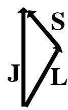

Figure 2A-1. Angular momentum coupling in the valence electron of an alkali atom.

In spectroscopic notation, the electronic state is written  $^{2S+1}$  L  $_J$  so that the ground state of an alkali atom is designated  $^2S_{1/2}$ . The first excited state has an L value of 1  $\hbar$ , and is designated as a P state. Higher values of L are given the label D, F, .... by convention.

In the case of the P state, J can only have the values L+S and L-S. Thus, there are the two states,  $^2P_{1/2}$  and  $^2P_{3/2}$ , for the single electron in an alkali atom. These states have different energies. This energy splitting is called the **Fine Structure**, and is shown diagrammatically in Figure 2A-2. Please note, Figure 2A-2 is not to scale! The fine structure splitting is *much*, *much*, *much*, smaller than the energy difference between the ground state and the first excited state.

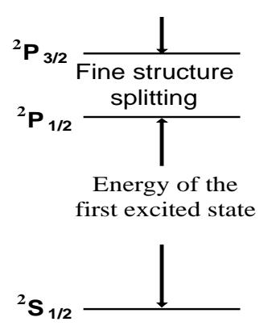

Figure 2A-2. Energy level diagram of an alkali atom.

We must now take into account the properties of the nucleus of the atom. In particular, we must consider the nuclear spin and the nuclear magnetic dipole moment. Many nuclei have an intrinsic angular momentum, similar to that of the electron, with different values depending on the nucleus.

Associated with this spin is a magnetic dipole moment. In the approximation that we are considering here, the nuclear moment will couple with the electronic magnetic dipole moment associated with **J** to form a total angular momentum of the atom, **F**. In the context of the vector model, the coupling is as shown in Figure 2A-3.

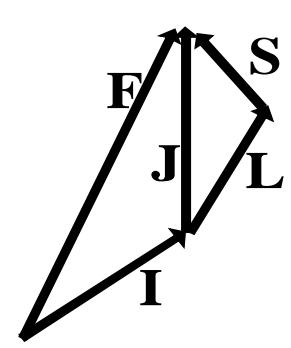

Figure 2A-3. Hyperfine coupling in an alkali atom.

The nuclear spin is denoted by **I,** the interaction is again of the form µ**I** · µ**J,** and the result is a further splitting of the energy levels called the **Hyperfine Structure**. This energy can be characterized by a Hamiltonian as:

$$\mathbf{H} = \mathbf{ha} \, \mathbf{I} \cdot \mathbf{J} \qquad \qquad \mathbf{2A-1}$$

where h is Planck's constant and a is a constant that is different for each electronic state and is

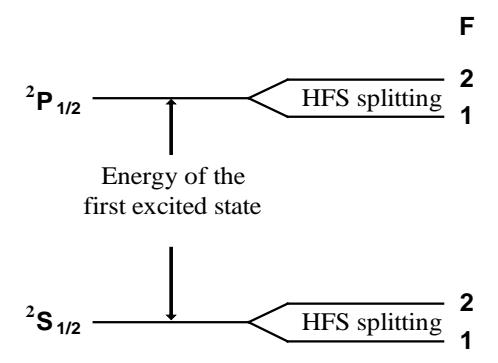

Figure 2A-4. Hyperfine splitting for **I** = 3/2

determined experimentally. The eigenvalues of this Hamiltonian give the interaction energies as shown in Figure 2A-4.

#### **REFERENCES**

[2A-1] J. C. Slater, "Quantum Theory of Atomic Structure" (McGraw-Hill. New York, 1960).

# 2B. Interaction of an Alkali Atom with a Magnetic Field

e must now consider the effect of a weak external magnetic field on the energy levels of our alkali atom. This will produce the **Zeeman Effect**, and will result in further splitting of the energy levels. What is meant by "weak" magnetic field? If the resulting splitting is very small compared to the **Hyperfine Splitting** (HFS), the magnetic field is said to be weak. This will be the case in all the experiments discussed here.

A vector diagram for an alkali atom is shown in Figure 2B-1. **B** designates the magnetic field, and M is the component of **F** in the direction of the magnetic field. **F** precesses about the magnetic field at the **Larmour** frequency.

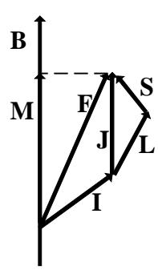

Figure 2B-1. Zeeman effect in an alkali atom.

The Hamiltonian that accounts for the interaction of the electronic and nuclear magnetic moments with the external field is as follows:

$$\mathbf{H} = \text{ha } \mathbf{I} \cdot \mathbf{J} - \frac{\mu_J}{J} \mathbf{J} \cdot \mathbf{B} - \frac{\mu_I}{I} \mathbf{I} \cdot \mathbf{B}$$
**2B-1**

where  $\mu_J$  is the total electronic magnetic dipole moment (spin coupled to orbit), and  $\mu_I$  is the nuclear magnetic dipole moment. The resulting energy levels are shown in Figure 2B-2 for the  $^2S_{1/2}$  ground electronic state with a positive nuclear magnetic moment and a nuclear spin of 3/2. The levels are similar for the  $^2P_{1/2}$  state. For reasons that will become clear later we will ignore the  $^2P_{3/2}$  state. As can be seen from Figure 2B-2 the magnetic field splits each F level into 2F + 1 sublevels that are approximately equally spaced. In actuality they vary in their spacing by a small amount determined by the direct interaction of the nuclear magnetic moment with the applied field. We will take advantage of this later on to allow all of the possible transitions to be observed.

2B-3

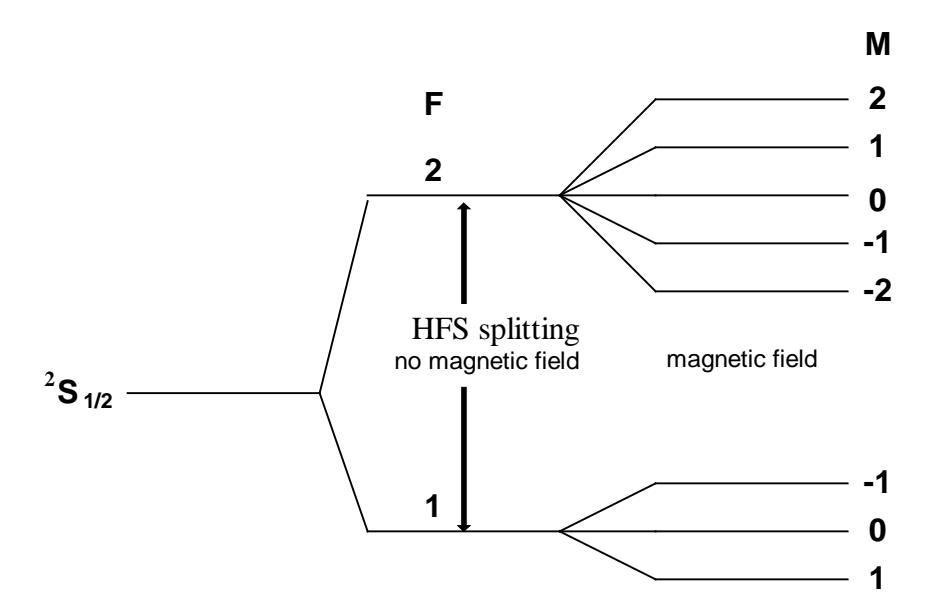

Figure 2B-2. Energy levels of an alkali atom in the  ${}^{2}S_{1/2}$  state with a nuclear spin of 3/2 and a positive nuclear magnetic dipole moment in a weak magnetic field.

In the case of an atom with either J=1/2 or I=1/2, the energy levels can be calculated in closed form from quantum mechanics, and this solution is called the Breit-Rabi equation. To proceed further, we need to consider the atom-magnetic field interaction in more detail. A single electron has spin of 1/2 and an electrical charge of about  $1.6 \times 10^{-19}$  coulomb. In the simplest picture, this rotating charge gives rise to a magnetic dipole moment whose magnitude is equal to  $\mu_0$ , the Bohr magneton. If the electron is bound in an atom, its effective magnetic moment is changed, and it can be best described by means of the Lande g-factor.

If the nucleus is neglected, the vector model [2B-1] is used to write the energy of interaction of an atom with an external magnetic field as

Magnetic energy = 
$$\frac{M(\mathbf{L} + 2\mathbf{S}) \cdot \mathbf{J}}{I^2} \mu_0 B = g_J \mu_0 MB$$
 2B-2

where  $g_J$ , known as the **Lande g-factor**, is given by

$$g_J = \frac{(\mathbf{L} + 2\mathbf{S}) \cdot \mathbf{J}}{J^2}$$

This can be evaluated from the vector model to be

$$g_J = 1 + \frac{J(J+1) + S(S+1) - L(L+1)}{2J(J+1)}$$
 2B-4

In terms of this g-factor, the interaction energy of the electronic spin with a magnetic field can be expressed as

$$W = -g_{I}\mu_{0}BM$$
 2B-5

where B is the magnitude of the magnetic field and M is the component of the electron spin along the magnetic field. In the case of rubidium, where  $J = S = \frac{1}{2}$ , the Lande g-factor is 2. Actually the measured g-factor turns out to be 2.00232.

If the interaction with the nucleus is considered, the g factor is given by

$$g_F = g_J \frac{F(F+1) + J(J+1) - I(I+1)}{2F(F+1)}$$
 2B-6

The interaction energy is then given by

$$W = g_E \mu_0 BM$$
 2B-7

where the direct interaction of the nuclear moment with the magnetic field is being neglected.

The above results are satisfactory as long as the interaction energy with the magnetic field is small, and the energy levels depend only linearly on the magnetic field. For the purposes of our experiment we need to consider terms quadratic in the field. Equation 2B-1 can be diagonalized by standard methods of perturbation theory. The result is the Breit-Rabi equation

$$W(F,M) = -\frac{\Delta W}{2(2I+1)} - \frac{\mu_I}{I}BM \pm \frac{\Delta W}{2} \left[ 1 + \frac{4M}{2I+1}x + x^2 \right]^{1/2}$$
 **2B-8**

where

$$x = (g_J - g_I) \frac{\mu_0 B}{\Delta W} \qquad g_I = -\frac{\mu_I}{I \mu_0}$$
 **2B-9**

W is the interaction energy and  $\Delta W$  is the hyperfine energy splitting.

A plot of the Breit-Rabi equation is shown in Figure 2B-3. The energy is shown on the vertical axis field as the dimensionless number  $W/\Delta W$ , and the horizontal axis shows the magnetic field as the dimensionless number x. The diagram can be divided into three main parts. The first is the Zeeman region very close to x=0 where the energy level splitting varies linearly with the applied magnetic field. The second is the Paschen-Back region x>2, where the energy levels are again linear in the magnetic field. This corresponds to the decoupling of I and J. The upper group of four levels corresponds to  $m_J$ , the projection of J along the axis of the applied magnetic field, having a value of 1/2, while the four lower levels correspond to  $m_J=-1/2$ . The individual levels correspond to different values of  $m_I$ , the projection of I along the axis of the applied magnetic field.

The third region is the intermediate field region that extends from the Zeeman to the Paschen-Back region. Here the energy levels are not linear in the applied magnetic field; I and J are decoupling, and M is no longer a "good" quantum number. In the Zeeman region, M is a good quantum number. At high fields, mI and mJ are good quantum numbers and can be used to label the levels. At all fields, M = mI + mJ.

In the optical pumping experiment, we will be concerned with small magnetic fields, where the levels are either linear in the magnetic field or where there is a small quadratic dependence.

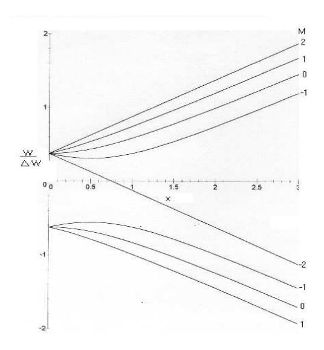

Figure 2B-3. Breit-Rabi diagram of an alkali atom in a magnetic field. The nuclear spin is 3/2 and the nuclear magnetic moment is positive.

#### **REFERENCES**

- [2B-1] J. C. Slater, "Quantum Theory of Atomic Structure" (McGraw-Hill, New York, 1960).
- [2B-2] N. F. Ramsey, "Molecular Beams" (Oxford University Press, London, 1969).

# 2C. Photon Absorption in an Alkali Atom

he three lowest electronic states of an alkali atom are shown in Figure 2A-2. As discussed there, if all filled electron shells are omitted, three these states can be labeled as T

 ground electronic state: 5s 2 S1/2

first excited electronic state: 5p 2P1/2

 second excited electronic state: 5p 2 P3/2

An electric dipole transition can take place between S and the P states with the selection rules ∆L = 0, ±1 but not L = 0 to L = 0, ∆S = 0, and ∆J = 0, ±1. Thus, this type of transition can occur from the ground state to both of the excited states.

In the optical pumping experiment, we are primarily interested in the absorption of light

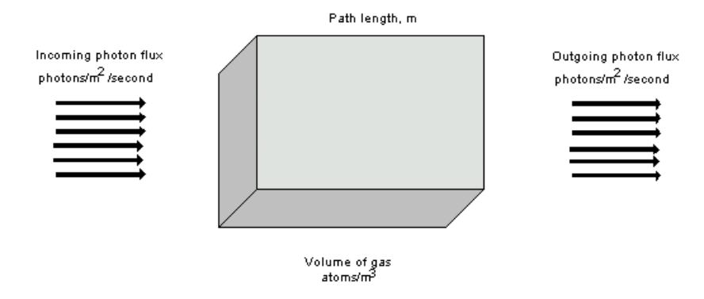

Figure 2C-1. Light absorption by a volume of gas.

by a volume of a gas as illustrated in Figure 2C-1. Assuming that the light is resonant with one of the above transitions, a fraction of the incident light will be absorbed by the atoms of the gas. Once the atoms have been excited, they will decay back to the ground state by spontaneous emission, but since this emission occurs equally in all directions, only a small amount will be radiated into the outgoing beam. For our discussion, this fraction will be ignored.

It is convenient to describe this process using the concept of a "cross section". Suppose, for instance, that the incoming beam consisted of electrons instead of photons. In that case, the attenuation of the incoming electrons by the gas atoms can, in the limit of low density, be described by the simple relation

$$n = n_0 e^{-\sigma \rho \ell}$$
 2C-1

where  $n_0$  and n are the incident and outgoing flux of electrons,  $\rho$  is the gas density,  $\ell$  is the path length through the gas, and  $\sigma$  is the cross section. In the case of electron-atom, or atomatom scattering, the magnitude of the cross section is of the order of  $10^{-20}$  m2, which is  $(10^{-10})^2$ , and  $10^{-10}$  m is taken to represent the geometrical diameter of the atom.

A similar concept can be applied to the absorption of photons by a volume of gas. Here we write:

$$I = I_0 e^{-\sigma_0 \rho \ell}$$
 2C-2

where  $I_0$  and I represent the incident and outgoing flux of photons. If the incident photons are resonant with an atomic transition, the observed cross-section will be dramatically different from the geometrical cross-section. In fact, this cross-section is often taken to be of the order of the wavelength of the radiation squared. In this experiment, you will attempt to measure the photon absorption cross-section for rubidium resonance radiation on rubidium atoms, and you can compare your measured value with expectations.

The quantity  $\sigma_0$  is the maximum absorption cross-section measured at the center of the atomic resonance, and it is related to the usual definition of the absorption coefficient by

$$k_0 = \sigma_0 \rho \qquad \qquad 2C-3$$

For an absorption line that is being broadened only by the Doppler effect, the maximum absorption coefficient can be calculated from

$$k_0 = \frac{2}{\Delta V_D} \cdot \frac{\lambda_0^2 g_2}{8\pi g_1} \cdot \frac{\rho}{\tau}$$
 2C-4

where  $\lambda_0$  is the wavelength at the center of the absorption line,  $\Delta \nu_D$  is the Doppler width of the absorption line,  $g_1$  and  $g_2$  are the statistical weights of the lower and upper state respectively, and  $\tau$  is the radiative lifetime of the upper electronic state. The Doppler width can be calculated from

$$\Delta v_D = 3 \times 10^{-20} v_0 \left(\frac{T}{M}\right)^{\frac{1}{2}}$$
 2C-5

where  $v_0$  is the transition frequency, T is the absolute temperature of the absorbing gas, and M is the mass of the absorbing atom.

For optical pumping, we must take the hyperfine structure into account. The energy levels are as shown in Figure 2A-4. Now, an additional selection rule,  $\Delta F = 0$ ,  $\pm 1$ , must be added for changes in the total angular momentum quantum number. Additional splitting is introduced by an external magnetic field, as shown in Figure 2B-2, requiring yet another selection rule  $\Delta M = 0$ ,  $\pm 1$ . Thus, the selection rules for an electric dipole transition can be summarized by

Electric dipole transition: 
$$\Delta S = 0$$
,  $\Delta J = 0$ ,  $\pm 1$ ,  $\Delta L = 0$ ,  $\pm 1$  but not  $L = 0$  to  $L = 0$   $\Delta F = 0$ ,  $\pm 1$  and  $\Delta M = 0$ ,  $\pm 1$ 

In the emission spectrum of an alkali atom, all transitions obeying the above selection rules are observed, and these give rise to the well-known bright line spectrum (the emission Zeeman effect will be ignored in this discussion). In absorption, however, things can be somewhat different in regard to the selection rule for M. Since angular momentum must always be conserved, the absorption of light in the presence of an applied magnetic field will depend on the polarization of the light and the direction of the incoming beam of light with respect to the direction of the magnetic field. For our purposes, we are only interested in the absorption of circularly polarized light that is resonant with the transition from the  ${}^2S_{1/2}$  state to the P states.

In the optical pumping experiment, the direction of the incident light is parallel to the applied magnetic field, and the light is polarized so that it is either right or left circularly polarized. In this arrangement only transitions in which M changes by +1 or -1 are allowed, but not both. Pumping will occur in either case as will be discussed later.

The above discussion applies to allowed electric dipole transitions in an atom. We must also consider magnetic dipole transitions that are about  $10^5$  times weaker than in the electric dipole case. The transitions in which we will be interested occur in the hyperfine structure and between the magnetic sublevels, and will only be observed in absorption. The selection rules are  $\Delta F = 0$ ,  $\pm 1$  and  $\Delta M = 0$ ,  $\pm 1$ . Which transitions occur depends on the orientation of the RF magnetic field with respect to the dc magnetic field.

In our experiment, the RF magnetic field is perpendicular to the dc magnetic field. In this case, the only transitions that can occur have  $\Delta F=0,\pm 1$  and  $\Delta M=\pm 1$ . The  $\Delta F=\pm 1$  transitions occur at RF frequencies of several gigahertz (GHz), and can not be observed with this apparatus. Therefore, we will only be concerned with  $\Delta F=0$  and  $\Delta M=\pm 1$ .

In the case of allowed electric dipole transitions in emission, the lifetimes of the excited states are of the order of 10-8 second resulting in a natural line width of several hundred megahertz (MHz). The actual line width, determined by Doppler broadening, is of the order of one GHz. For magnetic dipole transitions in the hyperfine structure of the ground electronic state the lifetimes for radiation are much longer, and collision processes will determine the actual lifetimes.

#### REFERENCES

[2C-1] Allan C. G. Mitchell and Mark W. Zemansky, "Resonance Radiation and Excited Atoms (Cambridge Univ. Press, 1961).

# 2D. Optical Pumping in Rubidium

ptical pumping is a method of driving an ensemble of atoms away from thermodynamic equilibrium by means of the resonant absorption of light [2D-1, 2D-2, 2D-3, 2D-4]. Rubidium resonance radiation is passed through a heated absorption cell containing rubidium metal and a buffer gas. The buffer gas is usually a noble gas such as helium or neon. If it were not present, the rubidium atoms would quickly collide with the walls of the cell which would tend to destroy the optical pumping. Collisions with the buffer gas are much less likely to destroy the pumping, thus allowing a greater degree of pumping to be obtained.

The general arrangement of the apparatus is shown in Figure 2D-1.

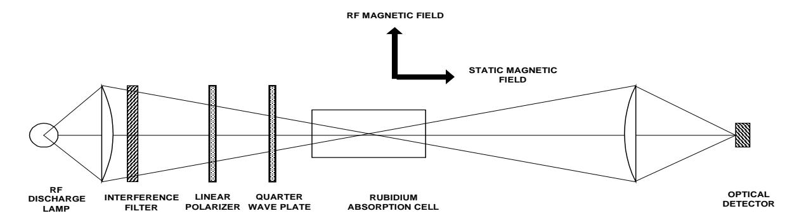

Figure 2D-1. Apparatus arrangement for optical pumping.

Resonance light is produced by an RF discharge lamp containing xenon gas and a small amount of rubidium metal, which has been enriched in Rb87 such that there are equal amounts of natural Rb and Rb87. The gas is excited by an oscillator operating at a frequency of about 100 MHz. The high electric field produced in the lamp causes ionization in the gas, and the resulting electrons are accelerated sufficiently to excite the rubidium atoms by collisions. Spontaneous radiation from the excited states produces the emission spectrum of rubidium.

Resonance light from the lamp consists of two main lines one at 780 and one at 795nm. The 780 nm line is removed by the interference filter and the remaining light is circularly polarized before being passed through the absorption cell. An optical detector monitors the intensity of the transmitted light. A dc magnetic field is applied to the absorption cell along the optical axis, and transitions are induced in the sample by means of a transverse RF magnetic field.

Figure 2D-2 shows the magnetic fields and angular momenta involved in the optical pumping of rubidium. The projection of **F** along the magnetic field is the magnetic quantum number M, and this vector precesses about the applied magnetic field at the Larmour frequency. Note that the RF magnetic field is perpendicular to the applied dc magnetic field.

Transitions are induced between electronic energy levels by the optical radiation and between the Zeeman levels by means of the RF magnetic field. The optical transitions are shown schematically in Figure 2D-3 for those energy levels involved in the optical pumping of  $^{87}$ Rb which has a nuclear spin of 3/2. The transitions are shown for the case of  $\Delta M = +1$ , but the situation would be similar for  $\Delta M = -1$  except that the pumping would go to the M = -2 level of  $^2S_{1/2}$  electronic ground state.

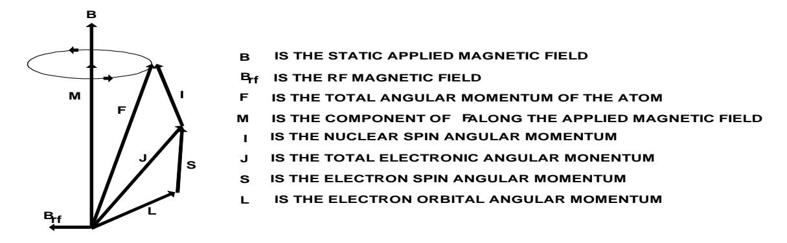

Figure 2D-2. Magnetic fields and angular momenta involved in the experiment.

Due to the circular polarization of the incident light, there are no transitions from the M=+2 magnetic sublevel of the ground state since there is no M=3 state.

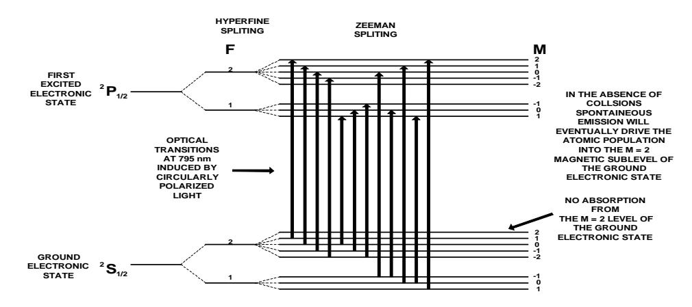

Figure 2D-3. Transitions involved in the optical pumping of 87Rb.

The excited states can decay back into this level by spontaneous emission of collisions providing a path into the level but not out of it. Hence the population of this level will increase with respect to the other sublevels. The population of the  $M=\pm 2$  level is monitored by the intensity of the transmitted light, and any process that changes this population, such as transitions between the M levels, will change the intensity of this transmitted light.

The intensity of the transmitted light is monitored by a photo diode whose output is amplified and observed on an oscilloscope or other recording device. The RF is set to a predetermined frequency and amplitude, and the magnetic field is slowly varied. The resulting output represents the transmitted light intensity as a function of applied magnetic field.

The optical pumping process itself will be studied in this experiment, and it will be determined that pumping requires a time of 10 - 20 milliseconds to achieve a suitable population of the M = +2 sublevel. Hence, the rate of variation of the magnetic field must be kept small in order for there to be sufficient absorption of the transmitted light.

If the above discussed processes were the only ones that occurred, the result would be a very large increase in the population of the M=+2 or M=-2 states. However we must consider collision processes between the pumped rubidium atoms and other rubidium atoms, and also collisions with atoms of the buffer gas. These collisions can result in transitions between the magnetic substates, and such transitions will tend to equalize the populations and destroy the optical pumping. In actuality, the amount of pumping will be determined by a balance between the rate of transitions into the pumped state and the rate at which atoms are removed from this state by collisional relaxation processes.

A set of rate equations can be used to describe the pumping process [2D-5]. Consider the isotope  $^{87}$ Rb that has a nuclear spin of 3/2 and a total of 8 magnetic sublevels in the ground electronic state. Let  $b_{ij}$  be the probability per unit time that an atom in the sublevel i of the ground state has undergone a transition to the sublevel j of the ground state by absorption and re-emission of a photon. Similarly let  $w_{ij}$  be the probability per unit time for the corresponding transition produced by relaxation processes. The occupation probability  $p_k(t)$  of the k-th level is obtained by the solution of the following set of eight simultaneous differential equations:

$$\dot{p}_k = -\sum_{i=1}^8 (b_{kj} + w_{kj}) p_k + \sum_{i=1}^8 (b_{ik} + w_{ik}) p_i \quad k = 1, 2, ... 8$$
 **2D-1**

Only seven of these equations are independent since  $\sum_{k} p_{k} = 1$ . The dot denotes

differentiation with respect to time, and the sums should exclude terms in which j=k and i=k. For a full discussion, see the article by Franzen and Emslie [2D-5]. It is shown there that the population of the M=+2 or the M=-2 state will increase exponentially with time after the pumping light is turned on and the population of the other M levels will decrease. Thus, an excess population in the level of maximum M will develop as compared to the population distribution in thermodynamic equilibrium. This is what is meant by the term "optical pumping".

#### REFERENCES

- [2D-1] Robert L. de Zafra, Am. J. Phys. volume?, 646 (1960).
- [2D-2] William Happer, Rev. Mod. Phys., **44**, 169 (1972).
- [2D-3] G. W. Series, Rept. Progr. Phys. **22**, 280 (1959).
- [2D-4] Alan Corney, "Atomic and Laser Spectroscopy" (Oxford Univ. Press, 1986).
- [2D-5] W. Franzen and A. G. Emslie, Phys. Rev. **108**, 1453 (1957).

# 2E. Zero Field Transition

Before we consider rf resonances in rubidium, it is necessary to discuss the transitions that can be observed at zero magnetic field. Assume that the apparatus is set up as in Figure 2D-1 and that no RF is applied. The magnetic field is now slowly swept around zero, and the intensity of the transmitted light is monitored. A decrease in intensity will be observed as the field goes through zero as shown in Figure 2E-1.

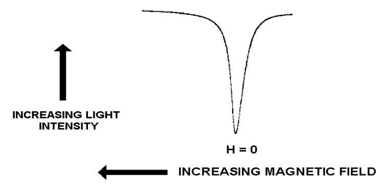

Figure 2E-1. Transition at zero magnetic field with no RF.

If the magnetic field is set to zero manually, a dc signal will be observed as a decrease in the intensity of the transmitted light. This can be understood qualitatively by referring to Figure 2E-2 which shows the energy levels near zero magnetic field. To either side of zero field, the levels are split in energy, and normal optical pumping occurs. However, at or near zero field, the levels become degenerate, optical pumping does not produce a population imbalance, and more light is absorbed.

The zero field signal provides a good way to determine the parameters for zero total magnetic field within the volume of the absorption cell. If the magnetic field is swept in time, and the output of the optical detector displayed on a scope, the field in the cell can be made as near zero as possible by adjusting the compensating coils and the orientation of the apparatus to achieve minimum line width. The above is true as long as the magnetic field is not swept too rapidly. Fast sweeping will produce time dependent effects which will be discussed later.

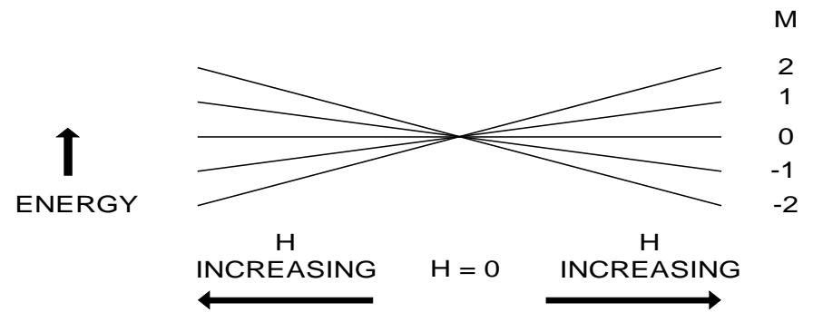

Figure 2E-2. Energy levels near zero magnetic field with no RF.

# 2F. RF Spectroscopy of Rb85 and Rb87

s mentioned in the previous section, optical pumping drives an atomic system away from thermodynamic equilibrium. Consider the energy levels of the ground electronic state as depicted in Figure 2D-3 which applies to  $^{87}$ Rb (nuclear spin of 3/2). We are interested in the levels for atoms in a weak magnetic field (far right of diagram). Since I = 3/2 and J = 1/2, the total angular momentum quantum number has the values of F = 2 or F = 1. The levels would be similar for  $^{85}$ Rb except in that case F = 3 or 2.

In thermodynamic equilibrium, the population of the magnetic sublevels of the ground electronic state would be essentially equal, and optical pumping will lead to an excess of population in either the M=2 or the M=-2 levels. After the pumping light has been on for a sufficient time, of the order of milliseconds, a new equilibrium will be established, and the intensity of the light transmitted by the cell will reflect this new equilibrium. If an RF magnetic field is applied as shown in Figure 2D-1 transitions with  $\Delta M=\pm 1$  will be induced, and these will tend to drive the system back toward thermodynamic equilibrium. The result will be a decrease in the intensity of the transmitted light.

Equation 2B-5 gives the relative energy levels of the ground electronic state. We can calculate the resonance transition frequency as

$$W(M+1) - W(M) = g_F \mu_0 B(M+1) - W(M) = g_F \mu_0 B$$
 **2F-1**

$$v = g_F \mu_0 B/h$$
 2F-2

where v is the transition frequency in  $\sec^{-1}$  and h is Planck's constant. For our experiment it is convenient to measure the magnetic field in gauss keeping in mind that  $10^4$  gauss is equal to one Tesla. Using these units  $\mu_0/h = 1.3996$  MHz/gauss. The above equations are true as long as the energy levels are a linear function of the applied magnetic field. When terms quadratic in the magnetic field need to be considered, an expansion for the frequency can be used as shown in the next paragraph. At higher fields yet the full Breit-Rabi equation must be used.

To obtain an expression for the transition frequencies that is good to terms quadratic in the magnetic field it is convenient to re-label the energy levels in terms of an average quantum number [2F-1]. The resonance frequencies for transitions between the levels  $|F, M\rangle$  and  $|F, M-1\rangle$  with energies W(F, M) and W(F, M-1) and mean azimuthal quantum number  $\overline{M} = M - \frac{1}{2}$  are

$$\omega_{FM} = (W_{FM} - W_{FM-1})/\hbar$$
 2F-3

Physically meaningful values of  $\overline{M}$  occur in the range  $-I \le M \le I$ .

The resonance frequencies correct to second order in the magnetic field are given by

$$\omega_{I+1/2,\overline{M}} = \frac{B(g_J \mu_B - 2\mu_I)}{(2I+1)\hbar} - \frac{2B^2 \overline{M} (g_J \mu_B + \mu_I / I)^2}{(2I+1)^2 \hbar^2 \omega_{hf}}$$
**2F-4**

$$\omega_{I-1/2,\overline{M}} = -\frac{B(g_J \mu_B + 2\{1 + 1/I\}\mu_I)}{(2I+1)\hbar} + \frac{2B^2 \overline{M} (g_J \mu_B + \mu_I / I)^2}{(2I+1)^2 \hbar^2 \omega_{hf}}$$
 2F-5

where  $\mu_B$  is the Bohr magneton and  $\hbar\omega_{hf}=(2I+1)~A/2$  is the energy splitting of the Zeeman multiplets at zero magnetic field. To first order in B the resonance frequencies are independent of  $\overline{M}$ . To second order in B the resonance frequencies exhibit a quadratic splitting proportional to  $B^2$   $\overline{M}$  which is the same for both Zeeman multiplets [2F-2].

#### **REFERENCES**

- [2F-1] A. Ben-Amar Baranga et al, Phys. Rev. A, 58, 2282 (1998).
- [2F-2] H. Kopfermann, "Nuclear Moments" (Academic Press, NY, 1958).

# **2G. Transient Effects**

p until now we have been considering optical pumping only in the steady state when the RF has been on for a relatively long time. We will now consider transient phenomena.

We referred in section 2D to the time it takes to establish equilibrium after the pumping radiation has been turned on. Here we will consider the behavior of the pumped system when the RF is rapidly turned off and on while tuned to the center of resonance. In the Zeeman region at weak magnetic fields the resonance frequency is given by

$$\omega_0 = 2\pi v_0 = g_f \frac{\mu_0}{\hbar} B_0$$
 2G-1

Define the **Gyromagnetic Ratio**  $\gamma$  as

$$\gamma = g_f \frac{\mu_0}{\hbar}$$
 2G-2

Then the Larmor frequency  $\omega_0$  is given by

$$\omega_0 = \gamma B_0$$
 2G-3

Thus  $\gamma$  is the atomic equivalent of the gyromagnetic ratio used in nuclear magnetic resonance.

Figure 2G-1 shows a vector diagram of the spin and the magnetic fields that are relevant to this experiment. The vector  $\mathbf{B}_{RF}$  represents the applied RF magnetic field that is provided by the coils at right angles to the static field. We will assume that the magnitude of the RF magnetic field is always much smaller than that of the static field. We will also consider the problem classically.

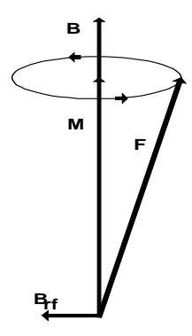

Figure 2G-1. **F** and its precession about **B**.  $B_{RF}$  is the RF magnetic field.

Consider the system as seen in a coordinate system that is rotating with about **B**. The equation of motion is

$$\frac{d\mathbf{F}}{dt} = \gamma \mathbf{F} \times \mathbf{B}$$
 2G-4

The oscillating magnetic field can be considered to consist of two counter-rotating magnetic fields, and transformed to a coordinate system rotating about B with angular frequency  $\omega$ . Then

$$\frac{d\mathbf{F}}{dt} = \frac{\partial \mathbf{F}}{\partial t} + \omega \times \mathbf{F}$$
 2G-5

or

$$\frac{\partial \mathbf{F}}{\partial t} = \gamma \mathbf{F} \times \mathbf{B} + \mathbf{F} \times \omega = \gamma \mathbf{F} \times (\mathbf{B} + \frac{\omega}{\gamma})$$
**2G-6**

$$= \gamma \mathbf{F} \times \mathbf{B}_{\text{eff}}$$
 2G-7

where

$$\mathbf{B}_{\text{eff}} = \mathbf{B} + \frac{\omega}{\gamma}$$
 2G-8

In the rotating frame, the effect is the addition of a magnetic field  $\frac{\omega}{\gamma}$  to the dc field **B** [2F-1].

Consider the RF field to be composed of two counter-rotating components of which one has an angular velocity of  $-\omega$  as shown in Figure 2G-2. The effective magnetic field is given by [2F-2]

$$\left| B_{eff} \right| = \left[ (B - \frac{\omega}{\gamma})^2 + H_{rf}^2 \right]^{\frac{1}{2}} = \left| \frac{a}{\gamma} \right|$$
 2G-9

where

$$a = \left[ (\omega_0 - \omega)^2 + (\gamma B_{rf})^2 \right]^{\frac{1}{2}} = \left[ (\omega_0 - \omega)^2 + (\frac{\omega_0 B_{rf}}{B})^2 \right]^{\frac{1}{2}}$$
**2G-10**

and

$$\omega_0 = \gamma B_0$$
,  $\cos \theta = \frac{\omega_o - \omega}{a}$  2G-11

At resonance  $\omega = \omega_0$ ,  $\cos \theta = 0$  and  $\theta = 90^\circ$ .

Also 
$$a = \frac{\omega_0 B_{rf}}{B}$$
 and  $\left| B_{eff} \right| = \frac{\omega_0 B_{rf}}{\gamma B} = \gamma B \cdot \frac{B_{rf}}{\gamma B} = B_{rf}$ .

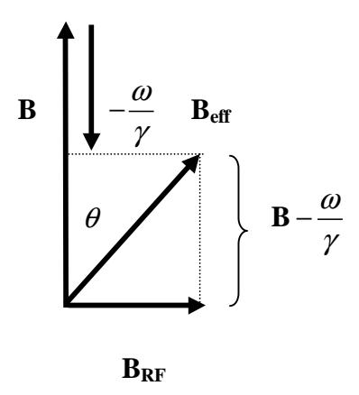

Figure 2G-2. Magnetic fields in the rotating coordinate system.

At resonance in the rotating frame, **F** precesses at the Larmor frequency about  $\mathbf{B_{RF}} = \mathbf{B_{eff}}$ . Off resonance, it precesses about  $\mathbf{B_{eff}}$ . This precession is equivalent to a change in the quantum number M or a transition between the M sublevels. At resonance the Larmor frequency is  $\mathbf{v} = \gamma B_{rf}$  resulting in a period of  $T = 1/\gamma B_{rf}$ . At a given value of the RF magnetic field the ratio of the periods of the two isotopes is  $\frac{T_{87}}{T_{85}} = \frac{\gamma_{85}}{\gamma_{87}}$ . In the present experiment we will only be interested in the situation at resonance.

Assume that the optical pumping has created an excess population in the M=2 sublevel in the absence of RF. To the approximation used here, we will consider only the M=2 and M=1 sublevels, and neglect all effects of collisional relaxation. Assume now that the RF is applied at the resonance frequency. The situation is as depicted in Figure 2G-3.

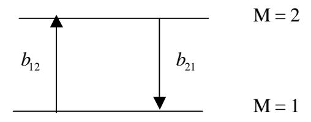

Figure 2G-2. RF transitions between the M=2 and the M=1 sublevels.

The arrows labeled  $b_{12}$  and  $b_{21}$  represent the transition probabilities from the M=1 to the M=2 and the M=2 to the M=1 sublevels respectively. The rate equations are:

$$\dot{p}_2 = -b_{21}p_2 + b_{12}p_1$$

$$\dot{P}_1 = -b_{12}p_1 + b_{21}p_2$$
2G-13

However,  $b_{12} = b_{21} = b$ . The equations are not independent. Therefore, we will consider only one of them and the normalization condition.

$$\dot{p}_2 = -bp_2 + bp_1$$
 2G-13

$$p_1 + p_2 = 1$$

Substitution yields 
$$\dot{p}_2 = b(1-2p_2)$$
 **2G-14**

The solution is 
$$p_2 = \frac{1}{2} + \delta e^{-2bt}$$
 **2G-15**

$$p_1 = \frac{1}{2} - \delta e^{-2bt}$$

where  $\delta$  represents the initial excess population in  $p_2$ . At t=0  $p_2=1/2+\delta$  and approaches 1/2 at  $t=\infty$ . Similarly  $p_1=1/2-\delta$  at t=0 and approaches 1/2 at  $t=\infty$ . Thus the effect of the RF is to equalize the population of the two states.  $\delta$  depends on the intensity of the optical pumping radiation and b is proportional to the current in the RF coils.

The above calculation suggests an exponential approach to the equal population condition. The situation is different, however, if the RF is suddenly turned on at the resonance frequency after the optically pumped equilibrium has been attained. Since the transition probability is the same for the up or down transition, and the initial population of the upper state is greater than that of the lower, the number of downward transitions will be greater than that of the upward and excess population will be created in the lower state. This will result in a rapid decrease in the intensity of the transmitted light.

Now the situation is reversed, and an excess population will again be transferred to the upper state resulting in a rapid increase in the intensity of the transmitted light. If the transmitted light intensity is being monitored as a function of time, a damped ringing signal will be observed [2G-3], and the period of this ringing will correspond to the Larmor frequency for the precession of **F** about the RF magnetic field as seen in the rotating frame.

The above treatment neglects the effects of the other magnetic sublevels and also the effects of collisions between rubidium atoms and collisions between rubidium atoms and the buffer gas. However, the basic properties of the observed signal are described.

Before the RF is applied the initial population of the  $p_2$  state is  $\frac{1}{2} + \delta$ . The time to reach  $\frac{1}{e}$  of this value can be shown to be

$$t_{1/e} = \frac{1}{2b}$$
 2G-16

Thus this time is inversely proportional to the RF perturbation and to the current flowing in the RF coils. It is instructive to measure this time as a function of the RF current.

## **REFERENCES**

| [2G-1] |  | I. I. Rabi, N. F. Ramsey, and J. Schwinger, Rev. Mod. Phys. 26, 167 (1954). |
|--------|--|-----------------------------------------------------------------------------|
|        |  |                                                                             |

- [2G-2] N. F. Ramsey, "Molecular Beams" (Oxford University Press, London, 1969).
- [2G-3] F. D. Colegrove, L. D. Schearer, and G. K. Walters, Phys. Rev. **132**, 2561 (1963).

# **APPARATUS**

The specifications given here are not meant as a guarantee of performance, but as typical values. We expect individual instruments to vary. If, however, some value varies by more than a factor of two different from those given, this should be brought to the attention of TeachSpin Inc.

# 3A. Rubidium Discharge Lamp

he Rubidium discharge lamp consists of an RF oscillator, oven and gas bulb. The gas bulb is filled with a little Rubidium metal and a buffer gas. The bulb sits within the coil of the oscillator (Figure 3A-1). Stray ions within the bulb are accelerated by the RF electric fields caused by changing magnetic fields. Collisions between the accelerated ions and neutral atoms (both buffer gas atoms and vaporized Rb atoms) cause those atoms to be either ionized or to enter into an excited electronic state. Relaxation of the excited state by spontaneous emission results in the observed resonant radiation from the lamp. The bulb is heated in the oven to increase the Rb vapor pressure (see vapor pressure curves in theory section), and also to regulate the lamp temperature. The lamp intensity changes rapidly with temperature, increasing by 5%/°C at operating temperatures. The oven temperature is set to 120 °C ± 2 °C.

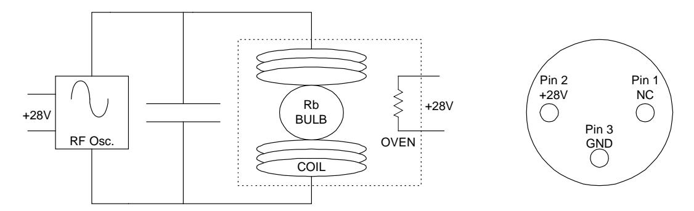

Figure 3A-1. a) Discharge Lamp

b.) Back Panel Lamp Connections

The bulb contains Rubidium in its naturally occurring isotopic concentration, 28% Rb87 and 72% Rb85. The buffer gas is Xenon. This lamp is an optically extended source of light with radiation from both isotopes of Rubidium and multiple lines from the buffer gas Xenon.

The specifications for the lamp are:

Oscillator Voltage +28 V DC Oscillator Current 120-160 mA Oven Voltage +28V DC

Oven Current 350 mA (Warm-up) 100mA (Steady-state)

Oscillator Frequency 75-90 MHz Oven Temperature 120 ± 2 °C Lamp Intensity1 all lines 9.0 µW 795 nm 1.7 µW

The electrical connections to the lamp are made at the back panel. The lamp uses +28 VDC for the oscillator and the oven. The connection looking into the back panel socket is shown in Figure 3A-1b. The Lamp oscillator, oven, and the experimental cell temperature controller all run off a separate +28V power supply.

*Voltage is supplied to the lamp when the main power is turned on*. Within a few minutes of applying power to the lamp you should see the pinkish discharge light. The oven within the lamp takes 10 to 20 minutes to stabilize. *It should be noted that the 795 nm spectral line that is used in the experiment is in the near infrared and cannot be seen by the human eye. The light that you see comes from other lines of Rubidium and Xenon.* 

1 The Lamp Intensity is measured by the photodiode. The photodiode was placed such that the front face of the photodiode was 15 cm. from the front face of the lamp and the diode adjusted vertically for a maximum signal. We use the specified responsivity of the diode as 0.6 A/W. For the single 795 nm line measurement the interference filter was placed between the lamp and diode, we assumed the transmission coefficient of the interference to be 0.80 (See figure 3C-1)

# 3B. Detector

The detector is a Silicon photodiode from Photonic Detectors Inc. PDB-C108 (See spec sheet Appendix A) The active area of the diode is circular, with a diameter of ¼ inch. The spectral response at 795 nm is about 0.6 A/W. The diode is connected to a current to voltage preamplifier. (See Figure 3B-1) To determine the current supplied by the photodiode, divide the output voltage by the "gain" resistance. The diode is used in photovoltaic mode (cathode grounded, rather than reversed biased) for minimum noise. The preamp is a current-tovoltage converter with three "gain" settings selectable by the small switch on the front of the detector. It has a two-pole low-pass filter to roll off the high frequency gain at about 10kHz.(see Table 3B-1). The photodiode preamplifier has a voltage output of 0.0 to -11.5 V*. It is important that the pre-amp be operated at a gain setting such that the output is between -2.0 to -8.0 V to avoid saturating the pre-amp.* Power connections to the preamp are by the black plastic connector to the front panel of the electronics box.

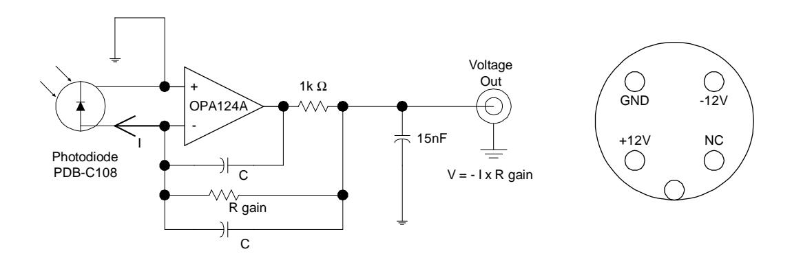

Figure 3B-1. a.) Schematic of Photodiode Preamplifier. b.) Preamp Power Connections

| Gain Resistor | Low pass 3dB point | Noise 2 |
|---------------|--------------------|---------|
| (MΩ) ± 5%     | (kHz) ± 10%        | (µVp-p) |
| 100 kΩ        | 60.0               | 3       |
| 1 MΩ          | 17.0               | 4       |
| 10 MΩ         | 5.5                | 8       |

Table 3B-1 Photodiode Preamplifier Specifications

The signal from the preamp is on the Coax cable with BNC connector labeled Detector. This separate detector connector allows the student to observe the signal from the preamp directly on an oscilloscope. Note: the signal from the preamp is negative with respect to ground.

 Peak to peak noise voltage measured with the front of photodiode covered and with a bandwidth of 0.1 Hz to 1 kHz. (Detector electronics: gain = 1000, Low- pass time constant = 1ms, 10s oscilloscope trace)

Normally, the preamplifier output will be plugged into the input of the detector section of the electronics box. *The detector inverts the signal from the preamp so that more light appears as a larger voltage on the meter or detector output.* The detector electronics consist of the follow sections:

**DC Offset:** 0 -10 V DC Set by ten turn potentiometer and fine control approximately 0-20 mV set by a one turn potentiometer. The fine control will only be useful at the highest gain settings.

**Gain:** 1, 2, 5 …100 Adjustable gain set by selector switch and X1, X10 set by toggle switch. Maximum gain is 1000.

**Low Pass Filter**: A two pole low pass filter with the following time constants; min., 1 ms, 10 ms, 100 ms, 1 s, 3 s. When set to min. the frequency response is determined by the gain setting of the preamplifier.

**Meter:** The meter displays the output voltage of the detector electronics. The range is -4 to +4 volts with the meter multiplier toggle set to X1 and -8 to +8 volts when set to X2.

There is 80 µVp-p (referred to the input) of 60 cycle pickup noise on the detector output.

# 3C. Optics

<u>Two plano-convex lenses:</u> Diameter 50mm, focal length 50mm. Plano-convex lenses minimize spherical aberrations when there are large differences in the object and image distance from the lens.

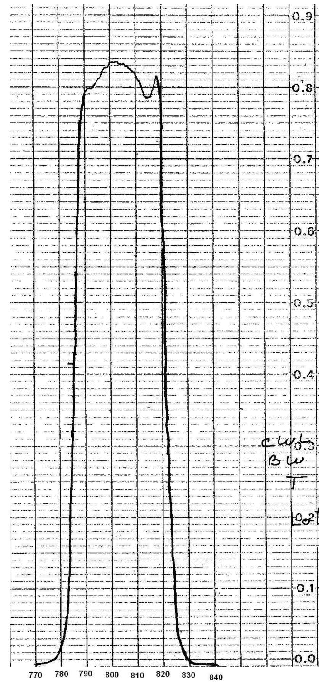

#### **Interference filter:** Diameter 50mm.

The transmission characteristics of the filter are shown in Figure 3C-1. We are mostly interested in the Rubidium D lines at 780nm and 795 nm. The transmission peak of the interference filter may be "tuned" to shorter wavelengths by rotation about the vertical axis. If  $\lambda_0$  is the peak wavelength and n is the index of refraction of the filter, then, when the filter is tilted at an angle  $\theta$  the new peak wave length will be given by,

$$\lambda_{\rm S} = \lambda_0 \left( 1 - \sin^2 \theta / n^2 \right)^{1/2}$$

(Source: Building Scientific Apparatus, Moore, Davis, and Coplan; Addison-Wesley Second edition pg. 166)

A "fun" experiment is to tilt the interference filter (IF) and let both rubidium D lines through. You will see lots of DC light, but the Optical Pumping signal gets much much smaller. Continue tilting IF and the 795 nm line will be blocked while only the 780 nm line will be allowed through. The Optical Pumping signal will now return!

Figure 3C-1 Transmission Characteristics of the Interference Filter

**Two Linear Polarizers in Rotatable Mounts**: Diameter 50mm. Figure 3C-2 shows the transmission and extinction characteristics of the polarizers. The linear polarizer mount has a alignment mark indicating the axis of polarization. The mark should be accurate to ±5°.

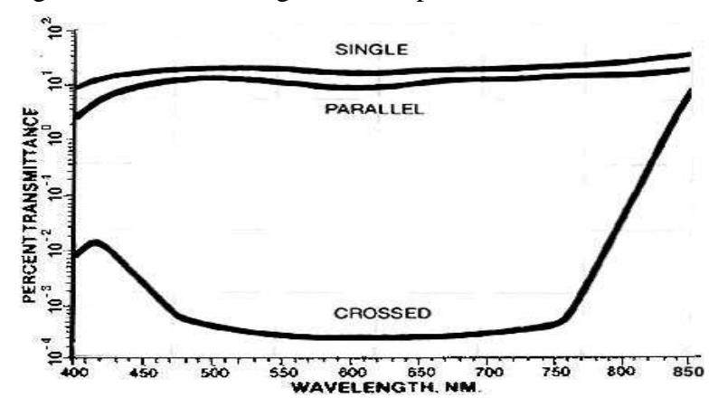

Figure 3C-2. Transmission Characteristics of Linear Polarizers

**Quarter Wavelength Plate in Rotatable Mount:** Diameter 50 mm, "optical thickness" 205 ± 5 nm. When properly oriented, the quarter wave plate allows linearly polarized light to be converted to circularly polarized light. The plate has two optical axes (at 90 degrees to each other) with different indices of refraction along each axis. Light travels at different speeds along each axis. The axes are called the "fast axis" and "slow axis".

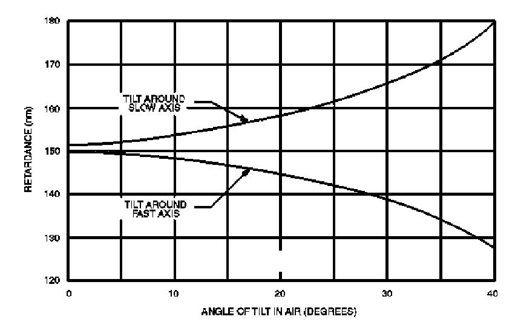

Figure 3C-3. Tilt Tuning of Quarter Wave Plate.

To produce circularly polarized light, monochromatic linear polarized light is placed incident to the plate at 45° to each axis. If the plate is of the correct thickness, then the phase lag along the slow axis causes light exiting the plate to be circularly polarized. The "optical thickness" of the plate may not be 795nm/4 which is the desired value. Tuning the optical thickness (retardation) can be accomplished by rotating the plate about the vertical axis. Rotation about the slow axis increases the retardation, and about the fast axis decreases it. See figure 3C-3. This tuning method requires that either the fast or slow axis be aligned vertically.

### **Alignment:**

During most of the alignment process it is helpful to have the room lights dimmed to reduce stray light interference. You do need a little light to be able to see the components and detector meter.

*Note that the magnet coils are NOT centered on the optical rail*. The short side is for the detector and the *longer side is for the lamp* and other optics.

The height of the experimental cell has been set so that its center is 3.5″ above the optical rail. This means that you will want to set all the rest of the optics so their centers are also at this height. It turns out that 3.5″ is also the length of a standard business card, a fact we have found useful for alignment.

The optics elements can be rotated both about the zaxis (the direction along the optical rail) and the vertical axis (towards the center of the Earth) in the alignment process.

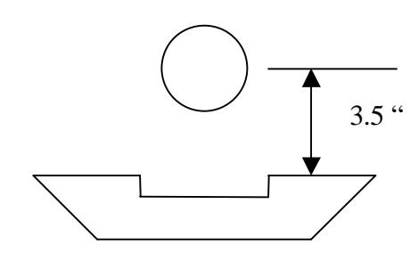

Figure 3C-4

- 1. Place the lamp near the end of the long side of the optical rail making sure to center the opening 3.5″ above the rail. (If you want to increase light intensity, you can move the lamp closer to the cell after you have all the optics aligned.) A ruler along one side of the optical rail will help with spacing the components.
- 2. Plug in the lamp, then turn on the electronics and set the cell temperature to 20° C. {The exact temperature is not critical. We just don't want the cell temperature to be set at some high temperature were there is very little transmission. If the cell is set at any temperature below 50 °C that should be fine.} It will take some time for the lamp to warm up.
- 3. Place the photodiode detector (PD) at the far end of the optic rail on the opposite side of the cell from the light source. Set the center of the detector opening at 3.5″ above the rail.
- 4. Set the gain on the PD to 1 MΩ (toggle switch down) and connect the PD to the electronics box. Set the electronics DC offset to zero and the gain to one.
- 5. Locate one of the plano-convex lenses so that its flat side is three to four centimeters from the front of the lamp. Because the lens has a focal length of 5 cm, this puts the center of the bulb at the focus of the lens. As a result, the emerging light will be collimated. We start here because the interference filter and ¼-wave plate work best with approximately parallel light rays. A perfectly parallel beam cannot be created because the bulb inside the lamp is approximately 10 mm X 15 mm. {If you want to see how well the lens actually works, you can try the following. Remove everything from the rail except the lamp and lens. Then, in a darkened room, observe how the shape and size of the beam spot change as you vary the lamp to lens separation.}

- 6. Now adjust the height of the lens and its position along the rail to maximize the signal coming from the detector.
- 7. Place the second lens on the short side of the optical rail with its flat side towards the PD. The separation between the lens and detector carriers should be about 1-2 cm. Start with the lens centered at 3.5″ above the rail and then adjust the position of this lens to maximize the signal from the PD. If you have done things correctly, you will find that there is so much light the PD goes off scale. (The signal will be greater than 10 volts.)
- 8. Put the rest of the optics into the beam path on the long side of the optical rail. The order should be Lamp, Lens, Interference Filter, Linear Polarizer, ¼ Wave Plate, Cell. This should attenuate the light enough so that you are not off scale.
- 9. Again maximize the signal by adjusting the lenses.

#### **Alignment of Polarizers:**

The alignment marks on the linear and circular polarizers are accurate to ±5°. The ¼-wavelength retarder may not be of exactly the right thickness. Careful alignment of these components can improve your signals by as much as 30%. However, this is not necessary to get a signal. For a quick alignment, set the linear polarizer at 45° and the ¼-wave plate at 0° or 90°. *The light needs to go through the linear polarizer before it passes through the ¼- wave plate.* (Be sure you understand why this is so.)

For a better alignment, remove the ¼-wave plate and set the first linear polarizer at 45°. Set the second linear polarizer in front of the detector and rotate it about the z-axis till you see maximum extinction, minimum signal. Typical "extinction" is about 2 % of the maximum signal. The alignment mark on the second polarizer should be close to 135° or 315° (90° difference from first polarizer). Now place the ¼-wave plate after the first polarizer and rotate the wave plate about the z-axis till you see a maximum signal. The alignment mark should be near 0, 90, 180, or 270°. You may now rotate the second linear polarizer about the z-axis, (using it as an analyzer) to determine the degree of circular polarization.

*For complete circular polarization, there should be no change in the signal level as you rotate the second linear polarizer.* Typical changes from maximum to minimum are between 0% to 50%. If there is a change in light level reaching the detector as you rotate the second linear polarizer, then you can "tune" the ¼-wave plate by rotation about the fast or slow axis. (See Figure 3C-3) Rotate the ¼-wave plate slightly (5-10°) about the vertical axis. Now rotate the second linear polarizer again and observe the relative changes in the signal. If the relative change is worse than before, then the ¼-wave plate needs to be rotated 90° about the z-axis. Otherwise continue tilting the ¼-wave plate about the vertical axis and analyzing the result with the second linear polarizer.

For the absolute best in alignment (given the components available), one needs to correct for the slight differences between the alignment marks and the real position of the axes. There are several ways to do this. The way we choose to do this is by adjusting the first linear polarizer to 45°. We do this by observing that at exactly 45° a rotation of 180° about the vertical axis is equivalent to a rotation of 90° about the z-axis.

Remove the ¼-wave plate and have in place only the two linear polarizers (LP). Set the first LP for 45°. Rotate the second LP about the z-axis until you observe the minimum signal. Record the position of the second linear polarizer. Now flip the first LP (rotate 180° about vertical axis). Again rotate the second LP about the z-axis until you observe the minimum signal. Record the position of the second LP. If the difference in position from the first reading is 90° then the first LP is at 45° to the vertical. If the difference is less than 90°, then increase the setting of the first LP by a few degrees (the amount you need to change it is exactly ½ the difference between your readings of the second LP and 90°).

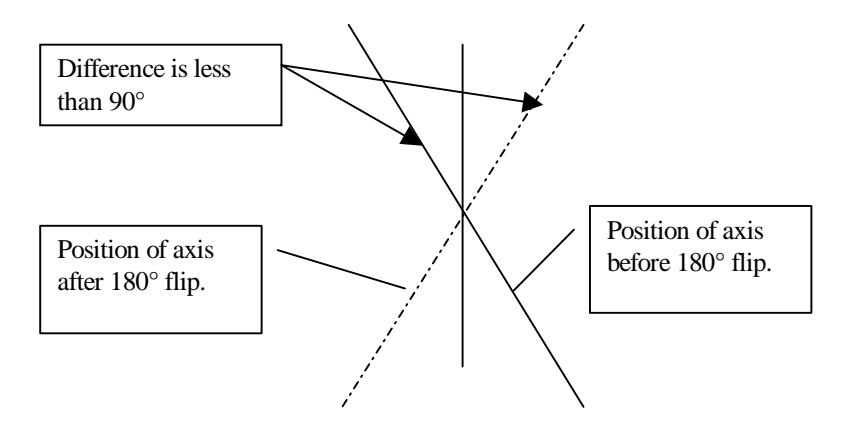

Figure 3C-5

If the difference is greater than 90° then you need to decrease the angle of the first LP. After the first LP is set to 45°, follow the previous steps for alignment of the ¼-wave plate.

# 3D. Temperature Regulation

The following components make up the cell temperature regulation system.

**Temperature regulator:** Proportional, Integral, Derivate (PID) temperature controller with associated electronics.

**Temperature probe:** Type T (Copper – Constantan) Thermocouple (5 µm wire) {Constantan is magnetic and the small wire size was chosen such that the magnetic effects of the probe were unobservable, but the small wire size also makes the probe very delicate.}

**Oven:** The oven contains the following:

**Rubidium cell:** The cell is a glass cylinder with an outside length of 36 mm an outside diameter of 25 mm and a wall thickness of about 1.5 mm. The cell contains rubidium metal with associated vapor and 30 torr of neon as a buffer gas.

**Cell holder:** A foam insert holds the cell in the center of the oven.

**Heater:** The heater is an open ended glass cylinder wrapped with non-magnetic bifilar wound heater wire. The resistance of the heater is about 50 Ω.

**Insulation:** A layer of foam insulation surrounds the heater.

**Oven casing:** The oven casing is a Plexiglas cylinder. The removable end caps contain 50mm optical windows. Holes in the casing allow for the heater wire and thermocouple wire to enter the inside of the oven. An RF wiring box (discussed in the RF section) is attached to the oven casing.

#### **Operation**:

The thermocouple plugs into a large blue plug on the lower front panel and the heater is connected to the blue banana plugs next to it. The control system for the Omega temperature controller is mounted on the upper left of the front panel. (A manufacturer's manual for the controller has been included.) Reading from left to right across the face of the unit, the four keys used to program the controller are: MENU, UP, DOWN and ENTER. When the controller is in the normal or RUN mode, the temperature is displayed in degrees Celsius.

Under normal operation, you will be changing only the temperature set-point. In the RUN mode, the controller will display the current temperature. To get into the Configuration Mode, press the MENU key until SP1 is displayed. Now, when the ENTER key is pressed, the display will show the current "Setpoint1." Use the UP and DOWN arrow keys to change the value. Once the correct value has been selected, press the ENTER key again to store the value. The display will show "StRd" briefly indicating your value has been registered. Return to the MENU key and continue pressing until RUN is displayed.

The minimum temperature is set by the ambient room temperature. The maximum temperature of about 100 °C is power limited by the 28 V power supply and the 50 ohm heater resistance. There is no need to worry about burning out the heater. There is simply not enough power to raise the temperature significantly above 100 °C.

The configuration of the controller has been done by TeachSpin. The Instrument Configuration list shown below includes only those items that have been changed by TeachSpin. The value in parenthesis is the main menu heading under which the changed settings are located. All other values are the factory default. See page 62 of the Controller Manual for details and additional explanations.

Set Point 1 (SP1) 50.0 Input Type (INPT) TC = t Temperature Unit (RDG) TEMP = C Filter (RDG) FLTR = 16 Control (OUT1) CTRL = PID Proportional Value (OUT1) PROP = 006.2

Reset Value (OUT1) REST = 0480 (Seconds) Rate Value (OUT1) RATE = 090.0 (Seconds)

Cycle period (OUT1) CYCL = 0001 Damping Value (OUT1) DPNG = 0005

To enter the Instrument Configuration mode in order to change the Proportional, Reset, or Rate values, press the MENU key until CNFG is displayed then press ENTER. Scroll through the various options with the MENU key until OUT1 (Output 1) is displayed, then, press ENTER. Again scroll through the options with the MENU key until the CTRL option is displayed. CTRL must be set to PID. Once this is set, keep scrolling until PROP, REST or RATE is displayed. Press ENTER and then use the UP and DOWN arrow keys to change the value. Press ENTER again to save and store the value. Once the changes have been made, use the Menu key to return to RUN mode. Please refer to section 3, page 15, of the controller manual for a complete description.

We have chosen the PID values (P = Proportional, I = Integral (reset), D = Derivative (rate)) for reasonable temperature stability around 50 °C.

There are several ways to tune the controller. One way is to use a list of tuning parameters for several different temperatures (Appendix B). The reset and rate numbers are listed in minutes and seconds while the current controller uses only seconds. To use this table you will have to convert to the correct units. A second method is to use the Auto tune function built into the controller. (We have not had much success with the Auto tune function.) For information on this, see page 38 of the Controller Manual.

Finally, there is a vast engineering literature on PID controllers (search the web under tuning + "PID controller"). A student who feels more comfortable with engineering than with the Wigner-Eckhart Theorem might enjoy determining the tuning parameters themselves. We have used the Ziegler-Nichols Closed Loop Tuning Method with some success. The controller temperature display does not have enough resolution to display the small thermal oscillations, used in this method to determine the tuning parameters. Instead, we monitored either the voltage going to the heater (by putting a voltmeter across the banana plugs of the electronic box) or by monitoring the oscillating light level through the rubidium cell. In either case it would be useful to have a strip chart recorder or computer with an Analog to Digital Converter to monitor the slow oscillations (periods of several minutes).

#### **Temperature Electronics:**

The DC pulse output from the Temperature Controller is passed through a low pass filter (τ = 10 s) and then amplified. The output on the blue banana plugs is a DC voltage from 0 – 26V with a slight 1 Hz ripple. The 1 Hz. ripple is from the 1.0 second cycle time of the DC pulse output.

# 3E. Magnetic Fields

All DC magnetic fields are produced by Helmholtz coil pairs. The coils are copper wire wrapped on phenolic bobbins. The following table lists their properties:

|            | Mean Radius cm(inches) | Turns/Side | Field/Amp (T x10 -4 /Amp) | Maximum Field (T x10 -4 ) |
|------------|------------------------|------------|-----------------------------------------|-----------------------------------------|
| Vertical   | 11.735                 | 20         | 1.5                                     | 1.5                                     |
| Field      | (4.620)                | 20         | 1.5                                     | 1.3                                     |
| Horizontal | 15.79                  | 154        | 8.8                                     | 22.0                                    |
| Field      | (6.217)                | 134        | 0.0                                     | 22.0                                    |
| Sweep      | 16.39                  | 11         | 0.60                                    | 0.60                                    |
| Field      | (6.454)                | 11         | 0.00                                    | 0.00                                    |

Table 3E-1 Magnetic Field Values The calibration of Field/Amp is only approximate.

The student will have to determine a more accurate value.

A simplified schematic of the current regulated field control circuitry is shown in Figure 2E-1. The circuit is a simple voltage-to-current converter. The Reference Voltage determines the voltage across the sense resistor and hence the current through the coils. The compensating network "tunes" out the coil inductance so that it appears as a pure resistance to the rest of the circuit. The compensating network draws no DC current.

The voltage across the sense resistor may be measured via tip jacks. The 100 ohms is in series so that the sense resistor can not be accidentally shorted by the student. Connections to the coils are made by the front panel banana plugs. *All the field controls are "unipolar*". If you wish to reverse the field direction you must switch the front panel banana jacks.

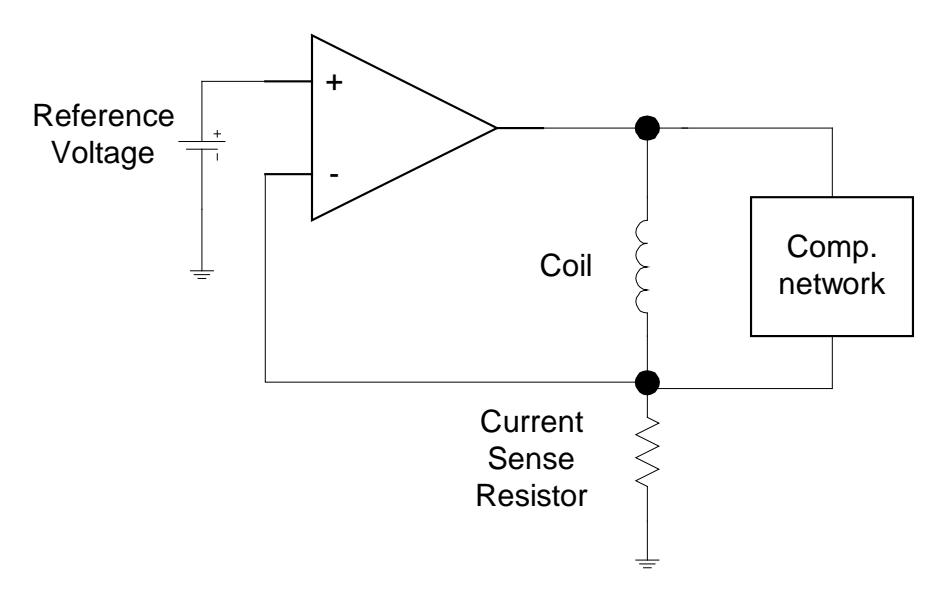

Figure 3.E-1 Schematic of Filed control circuitry.

**Vertical Field.** The Vertical Field is run between ground and the negative supply voltage. This is done because of the current limit of the power supply. The sense resistor is thus at - 15V with respect to ground*. Caution should thus be exercised if this voltage is monitored with anything but a floating voltmeter.* 

Sense Resistor: 1Ω, 1%. Monitoring of the sense resistor is done through the back panel tip jacks.

Polarity: The vertical coil is wired so that field will point downward when the red jack is in the red plug. This is the correct direction to cancel the Earths Field in the Northern hemisphere. If you are in the Southern hemisphere you should reverse the jacks. A current of about 0.33 Amperes will cancel the vertical field in Buffalo, NY. USA.

Control: The ten turn potentiometer sets the Reference Voltage. The maximum voltage is 1.0 Volt. (one turn = 0.1 Volt = 0.1 Ampere.)

**Horizontal Field.** The Main Horizontal Field can be run off the internal power supply with a maximum current of about 1.0 Ampere. Or an external power supply can be used to go to higher fields. The external power supply is connected to banana plugs on the back panel. A toggle switch on the back panel determines which supply is in use.

Sense Resistor: 0.5 Ω, 1%. Monitoring of the sense resistor is done via front panel tip jacks.

Polarity: The Horizontal Field is wired such that the field will point from the lamp towards the detector (in the direction of light propagation) when the red plug is in the red jack.

Control: The ten turn potentiometer sets the Reference Voltage. The maximum voltage is 1.5 Volt. (one turn = 0.15 Volt = 0.3 Ampere.)

External Power*: The following conditions must be obeyed when using an external DC power supply. The maximum voltage is 40V. The maximum current is 3.0 A. (The circuitry is fuse protected.) The red banana plug must be connected to the positive terminal of the power supply. (The circuitry is diode protected against reverse polarity.)*

There are a few other facts that the user should be aware of when using an external power supply. At room temperature, the main coil resistance is about 10 Ω. When large currents are used the coils temperature will increase (to about 75 ºC @ 2.7A). This increase causes an increase in the resistance of the coils (to about 12 Ω.)3 The changing coil resistance may cause the control circuitry to fall out of compliance. The large amount of heat being dissipated by the coils changes the thermal environment for the nearby cell and lamp. You may notice that it takes a long time for the cell temperature to stabilize. The temperature increase of the coil will also cause a change in the size of the copper coil. It might be instructive for the students to estimate the magnitude and sign of this change to determine if it would have any effect on their field calibration.

3 Because we are using a current regulated supply there is a potential for thermal runaway in this situation. As the temperature increases, the resistance also increases, but this causes more power to be delivered to the coils (I2R) which further increases the temperature.

 Error light: The error light will come on when the current regulated supply is close to being out of compliance (not enough voltage to supply the desired current). For efficient operation when using an external power supply the voltage of the external power supply should be set a few volts above the point where the error light comes on. The pass element of the control circuitry (which is the power transistor mounted on the back panel heatsink) must dissipate all the excess power. In the worst case scenario the pass transistor will warm up to 90 ºC.4 This is within transistor's specifications, but it will be happier and live a longer life if it is kept cooler.

**Horizontal Sweep Field.** We often refer to this field as just the Sweep field. The Sweep field coil is a single layer of wire wrapped on top of the Horizontal field coils.

Sense Resistor: 1.0 Ω, 1%. Monitoring of the sense resistor is done via front panel tip jacks.

Polarity: The Sweep Field is wired such that the field will point from the lamp towards the detector (in the direction of light propagation) when the red plug is in the red jack.

Control: The Reference Voltage for the sweep field is the sum of three voltages; a Start Field voltage, a Sweep voltage, and a Modulation voltage. We will discuss each in turn. The maximum current that the sweep control can supply is about 1.0 A. When turned to full scale both the Start field and Sweep (Range) voltage are about 1.0 V. This means that it is very easy to set the sweep control so that it is out of compliance*. There is no error light to warn the students when this happens.* They need to be alert to the possibility.

Start Field: The ten turn potentiometer sets the Start Field voltage. The maximum voltage is about 1.0 Volt. (one turn ≈ 0.1 Volt = 0.1 Ampere.)

Sweep Field: The Sweep voltage is a voltage ramp that starts at zero volts and goes to the voltage set by the ten turn potentiometer marked **Range.** The maximum range voltage is about 1.0 Volt. The ramp time is set by the selector switch marked **Sweep Time**. The sweep time may be set from 1 to 1000 seconds. Two toggle switches control when the ramp is started. When the **Start/Reset** toggle is at Reset, the Sweep voltage is zero. When the toggle is moved to **Start** the ramp is started. The **Single/Continuous** toggle determines what happens when the ramp finishes. When set to Continuous the sweep voltage will be reset to zero and then the ramp will repeat itself. If the Single/Continuous toggle is set to Single, then at the end of the ramp the sweep voltage will remain at the voltage maximum voltage set by the Range potentiometer. This is useful in setting up a sweep. With the toggle at reset (or the Range pot turned to zero) use the Start Field potentiometer to set the starting point for the sweep. Sweep quickly through the signal, and then use the Range potentiometer to set the end of the sweep.

4 This is with maximum voltage and the current set near the mid point. The pass element will have to dissipate the maximum power, for a given supply voltage, when the pass element voltage is equal to the load voltage, which will be equal to one half of the supply voltage.

Ext. Start: It is also possible to control the starting of sweeps electronically. The BNC labeled Ext. Start on the lower front panel accepts TTL signals. The input impedance is 1 kΩ. With the Start/Reset toggle set to Start, a positive TTL pulse (+5V) on the Ext. Start BNC will reset the sweep voltage to zero. On the falling edge of this pulse the sweep voltage will start to ramp. If the Controller is set to **Continuous**, the ramp will reset at the end of the ramp and start again. If set to **Single**, the ramp will stop after one sweep, and remain at the maximum voltage until the next pulse is received.

Modulation Voltage: As has been stated previously, the Reference voltage for the Horizontal Sweep Field is the sum of three different voltages; the Start Field voltage, the Sweep voltage, and the Modulation voltage. The Modulation voltage is derived from the controls labeled Magnetic Field Modulation on the upper front panel. The circuit for these controls is shown in figure 3E-2.

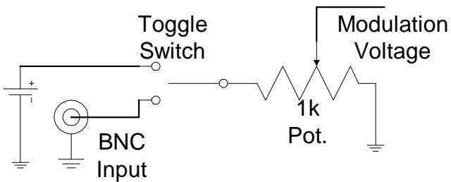

Figure 3E-2 Modulation Voltage Schematic.

The controls consist of a BNC input, a Start Field /MOD. toggle switch and a one turn potentiometer labeled Amplitude. The Modulation Voltage has several uses. With the toggle switch set to Start Field, the BNC input is excluded from the circuit and a small DC voltage is supplied to one side of the potentiometer. The Modulation voltage (which is the voltage on the potentiometer wiper) is then some fraction of this DC voltage. The Modulation voltage thus acts as a fine control of the start field. This is useful when you want to sit right on one of the dips in the Rubidium spectrum. The field range is 0 – 6 mG (60µT).

With the Start Field/MOD. toggle in the MOD. position, the voltage present on the BNC input is supplied to the potentiometer and becomes the basis for the modulation voltage with the following specifications:

 Input Impedance 1 k Ω Maximum Voltage ± 20 V Voltage - Field conversion 1V ≈ 10 mG

The modulation input can be used for at least two different types of investigations. When used in conjunction with either Lock-in or ac detection methods, it allows students to do magnetic field modulation experiments. If large Square wave signals are applied, the input can be used for Field Reversal Experiments.

#### Recorder Output and Recorder Offset.

The Recorder output is a signal derived from the 1Ω sense resistor that is suitable for driving a chart recorder or oscilloscope. The voltage across the 1Ω sense resistor has been amplified and passed through a low pass filter (time constant = 2 ms.). The signal can also be given a DC offset with ten turn Recorder Offset potentiometer which adds a negative DC voltage to the signal, (-15 Volts at full scale). The gain of the Recorder Output has been set so that 50mV ≈ 1 mG (10 µT), and the voltage can go from -13.5V to +13.5V. When setting up the largest possible sweeps of the instrument the student needs to keep the output within this range.

# 3F. Radio Frequency

The RF section consists of the following: RF coils,  $50 \Omega$  current sense resistor and RF amplifier. (See figure 3F-1) The RF coils are located on the outside of the cell heater.

Coils 3 turns/side, 18 gauge copper wire

Diameter 6.45 cm (2.54'')

Separation 10.80 cm (4.25") (not Helmholtz)

Inductance5 1.66 μH Parallel Capacitance6 24 pF

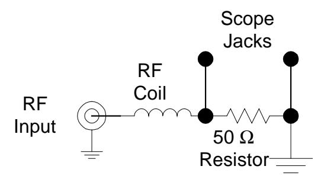

Figure 3F-1 RF Coil and 50  $\Omega$  Current Sensing Resistor.

The 50  $\Omega$ , 0.5 Watt, Current Sense Resistor is located in the electrical breakout box on the side of the cell. Oscilloscope probe jacks are on the side of the box so that you may measure the voltage across the resistor and thus measure the current in the coil. We have found that most scope probes are magnetic and would advise you to remove the probe after measuring the current. Because of the nuisance of attaching the probe to the sense resistor, the student may be tempted to simply measure the voltage at the output of the amplifier. Though this would be fine for measuring relative changes in RF amplitude at one frequency, it will not give an accurate measure of the current at high frequencies due to the effects of the long cable and finite coil impedance.

#### Radio Frequency Amplifier Specifications:

Input Impedance  $50 \Omega$ Output Impedance  $15 \Omega$ 

Frequency Range 10 kHz. – 30 MHz.

 $\begin{array}{lll} \mbox{Voltage Gain} & \mbox{6 V/V} \\ \mbox{Maximum Output Current} & 100 \mbox{ mA} \\ \mbox{Maximum Output Voltage} & \mbox{8 V}_{\mbox{p-p}} \\ \mbox{Maximum Output Power} & 100 \mbox{ mW} \\ \end{array}$ 

Modulation Input TTL input, 0 V = RF on, 5 V = RF off

5 Determined from frequency where voltage across coil is equal to voltage across  $50\Omega$  series resistor.

&lt;sup>6 The capacitance value was not measured directly but is inferred from the resonance at 25 MHz. with  $\omega = 1/(L*C)^{1/2}$ .

In addition to the input and output connections on the lower front panel, the RF amplifier has a single turn Gain control to adjust the output amplitude and a TTL RF Modulation Input by which the RF can be modulated on and off. The modulation input can be used with a Lock-in Amplifier or other AC detection technique. The output of the amplifier should be monitored with an oscilloscope to insure that the amplifier is not being overdriven (clipped). A clipped RF output will lead to harmonics and spurious signals.

# Section

# **EXPERIMENTS**

# 4A. Absorption of Rb resonance radiation by atomic Rb

n this first experiment you will make an approximate measurement of the cross-section for the absorption of rubidium resonance radiation by atomic rubidium. The measured value will then be compared with the geometric cross-section and the value calculated from theory.

The apparatus should be arranged as shown in Figure 4A-1. The linear polarizer and the quarter wave plate should be removed since they will not be needed for this experiment. The cell heater should be off, and the apparatus allowed to come to equilibrium. It may be necessary to insert a neutral density filter before the absorption cell to prevent saturation of the detector amplifier.

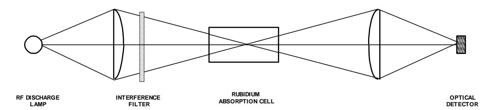

Figure 4A-1. Arrangement of the apparatus.

Set the cell heater to 300 K, and allow thermal equilibrium to be established. It will take about 30 minutes for the temperature to become stable. Measure the intensity of the optical signal taking care to record all amplifier gain settings. Repeat the measurement in temperature increments of 10 K, taking care that thermal equilibrium is reached between readings. Repeat the series of measurements as many times as possible both increasing and decreasing the temperature

Determine the density of atomic rubidium in the cell as a function of temperature from Table 4A-1, and fit the data to an equation of the form

$$I = ae^{-b\rho}$$
 4A-1

where  $\rho$  is the density of atomic rubidium in the cell. From the value of b determine the cross-section for the absorption of rubidium resonance radiation by atomic rubidium.

Compare your result with the calculated value of the cross-section and with the geometrical cross-section.

| Temperature, K | Density, atoms/cubic meter |
|----------------|----------------------------|
| 290            | 3.3 X 10 15     |
| 300            | 1.1 X 10 16     |
| 310            | 2.9 X 10 16     |
| 320            | 7.5 X 10 16     |
| 330            | 1.8 X 10 17     |
| 340            | 4.3 X 10 17     |
| 350            | 8.3 X 10 17     |
| 360            | 1.5 X 10 18     |
| 370            | 3.7 X 10 18     |
| 380            | 6.3 X 10 18     |
| 390            | 1.2 X 10 19     |
| 400            | 2.4 X 10 19     |

Table 4A-1. Density of rubidium atoms over solid or liquid rubidium as a function of temperature [4A-1].

#### **SAMPLE DATA**

| Temperature | Detector Output |
|-------------|-----------------|
| K           | Volts           |
| 300         | 1.57            |
| 310         | 1.31            |
| 320         | 1.06            |
| 330         | 0.72            |
| 340         | 0.52            |
| 350         | 0.24            |
| 360         | 0.17            |
| 370         | 0.14            |
| 380         | 0.13            |
| 390         | 0.12            |
| 400         | 0.12            |

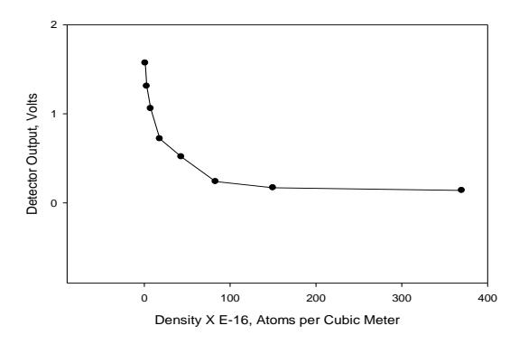

Figure 4A-2. Plot of Sample Data

It can be seen from the plot that above a density of about  $200 \times 10^{16}$  there is no further decrease in the intensity of the transmitted light. Ideally the cell should be optically thick, and no light should be transmitted. The light that is transmitted does not fall within the absorption profile of the rubidium in the cell, and hence gets through the cell and causes this background.

This radiation comes from the wings of the emission line and from the buffer gas in the discharge lamp. In order to correct for this a constant detector output voltage of 0.14 volt will be subtracted from all readings, and the plot and fit will be limited to the first seven points. The result is shown in Figure 4A-3.

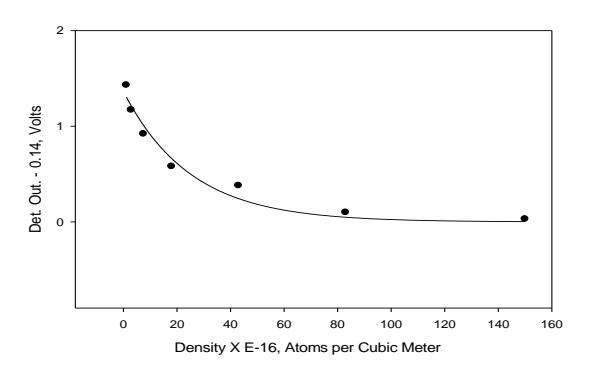

Figure 4A-3. Plot of Sample Data with Background Correction

Points are the data. Curve was fit using Sigma Plot© and nonlinear regression analysis to yield

$$I = 1.36e^{-0.040\rho}$$
 **4A-2**

The length of the absorption path was about 2.5 cm giving a result

$$0.025\sigma X 10^{16} = 0.040$$
 **4A-3**

and 
$$\sigma = 1.6X10^{-16} \text{ m}^2$$

This can be compared with the result calculated from the equations in section 2C, using a Doppler width at 350 K of about 550 MHz, and a center frequency of about 3.77 X  $10^{14}$  Hz. This corresponds to a center wavelength of 795 X  $10^{-9}$  m. The resulting maximum cross-section is  $\sigma_0 = 15 \times 10^{-16} \, \text{m}^2$ .

A more detailed calculation of the cross-section is in the literature [4A-2], and a value of about  $10 \times 10^{-16} \text{ m}^2$  is given there. The geometrical cross-section is about  $(10^{-10})^2 = 10^{-20} \text{ m}^2$ . Notice that the resonant cross-section is much larger than that normally associated with atomic scattering processes. As a point of interest, the value of the absorption cross-section for sodium resonance radiation in atomic sodium is  $12 \times 10^{-16} \text{ m}^2$  [4A-3].

Care needs to be taken in the interpretation of these results, since the cross-sections involved are somewhat ambiguous. The cross-section is a function of the frequency distribution in the absorption profile of the rubidium atom, and the intensity of the absorbed light will depend on the relationship of the intensity profile of the incident light to the absorption profile of the atom.

Therefore, the measured result should be considered to be only approximate. These considerations are discussed in detail in the literature [4A-4]. The main point here is to realize that the cross-section for absorption of resonance radiation by an atom is much larger than what is usually taken as a measure of the geometrical cross-section.

The measured cross-section is about 10 times smaller than that calculated from theory. However, considering the sources of error in the experiment, this is not unreasonable. One of the largest errors is the rapid variation of the density of rubidium atoms in the cell as a function of temperature. This dependence, as shown in the Table 4A-1, was calculated from graphical data contained in [4A-1], and is subject to considerable error.

## **REFERENCES**

- [4A-1] Values of density calculated from the vapor pressure data tabulated in "The Characterization of High Temperature Vapors", (John Wiley & Sons, 1967).
- [4A-2] A. M. van der Spek, J. J. L. Mulders and L. W. G. Steenhuysen, J. Opt. Soc. Am. **5**, 1478 (1988).
- [4A-3] Alan Corney, "Atomic and Laser Spectroscopy", pp288, (Oxford University Press, 1986).
- [4A-4] Allan C. G. Mitchell and Mark W. Zemansky, "Resonance Radiation and Excited Atoms", (Cambridge Univ. Press, 1961).

## 4B. Low Field Resonances

In all of the following experiments of this lab, it will be necessary to apply a weak magnetic field along the optical axis of the apparatus. In order to do this satisfactorily, the apparatus must be located where the local residual magnetic field is as uniform as possible. The proposed location should be surveyed with a compass to check for gross inhomogeneity in the local field, and the orientation of the horizontal component of the residual field should also be determined. All iron or steel objects should be removed from the vicinity of the apparatus. The instrument should be placed on a table made with no magnetic material, such as the one supplied for this experiment by TeachSpin.

The optical axis of the apparatus should be oriented such that the horizontal component of the residual field is along this axis. The apparatus should be set up as shown in Figure 4B-1, and the interference filter reinstalled. Be sure that the linear polarizer is ahead of the quarter wave plate in order to obtain circularly polarized light, and that the two are oriented properly.

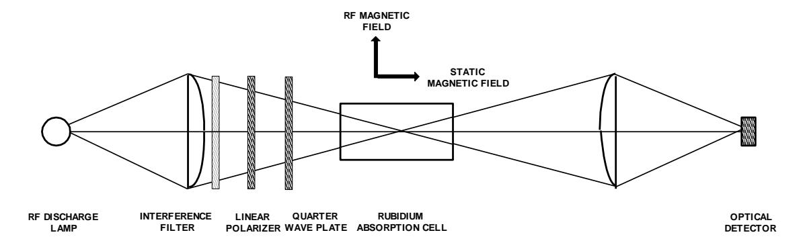

Figure 4B-1. Apparatus arrangement for optical pumping.

In order to observe the zero-field transition, no RF is applied and the magnetic field is swept slowly around zero. This is accomplished by varying the current in the sweep windings. The current through the main horizontal field coils should be set to zero. Adjust the current in the vertical compensating coils to achieve *minimum width* of the zero field transition. Also, check the orientation of the apparatus along the horizontal component of the residual field by rotating the apparatus about the vertical axis and setting for minimum line width.

Set the cell temperature to 320 K, and allow thermal equilibrium to be established. It is most convenient if the output of the optical detector is observed on the vertical axis of a storage oscilloscope, and a signal proportional to the current in the horizontal axis sweep coils is displayed on the horizontal axis. As will be shown later, optical pumping is a slow process. Therefore, during these experiments, it will be necessary to use a very slow sweep rate for the magnetic field current.

Figure 4B-2 shows the zero field resonance and the Zeeman resonances at a frequency of 0.0134 MHZ.

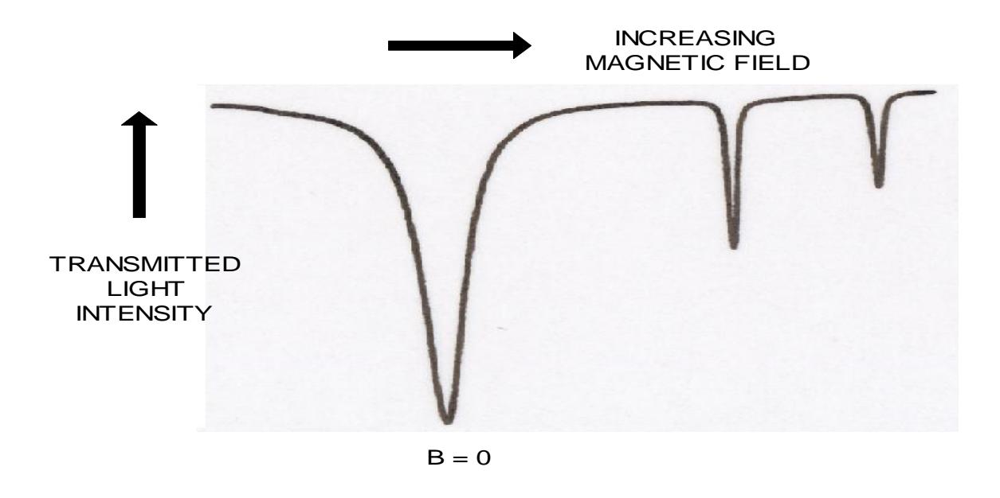

Figure 4B-2. Zeeman resonances and zero field resonance at very low magnetic fields.

#### MEASUREMENT OF THE NUCLEAR SPINS

There are two isotopes of rubidium, and they have different nuclear spins. We are going to pretend that we don't know their values, so we can measure them. In order to do this, we must measure the  $g_F$  values from which the spins can be calculated. This can be done by measuring a single resonant frequency of each isotope at a known value of the magnetic field. The magnetic field will be determined approximately from the geometry of the field coils. Since nuclear spins are either integral or half-integral, we need only an approximate value of the field.

We will use only the sweep field coils for this purpose. Their parameters are as follows:

Mean radius = 
$$0.1639 \text{ m}$$
 B(gauss) =  $8.991 \times 10^{-3} \text{ I N} / \overline{R}$  **4B-1** 11 turns on each side

where I is the current in amps, N is the number of turns on each side, and  $\overline{R}$  is the mean radius of the coils. The coils satisfy the Helmholtz condition. At the sweep monitor terminals on the front panel, a voltage is presented that is numerically equal to the current in amps (the current passes through a one ohm resistor). Use this voltage as a measure of the sweep coil current.

First, the residual magnetic field at the location of the absorption cell must be determined. Disconnect the main field coils so that there can be no current through them. Adjust the current in the sweep coils to center on the zero field resonance, and measure the current. From this and Equation 4B-1, calculate the value of the residual magnetic field. Be sure that there is no RF being applied.

An RF signal can now be applied to the RF coils, and its amplitude set to an arbitrary value. Later, this amplitude will be adjusted for optimum transition probability. The frequency of the RF should be set to about 150 KHz. Sweep the horizontal magnetic field, slowly increasing from zero, and search for the Zeeman resonances. Measure the current at which each resonance occurs.

An oscilloscope should be used to measure a signal proportional to the RF current at the connector on the cell holder. This signal is developed across a 50 ohm resistor that is in series with the RF coils, and therefore it is proportional to the amplitude of the RF magnetic field.

Measure the characteristics of the RF transitions as a function of the amplitude of the RF magnetic field, and determine the value that provides optimum transition probability [2G-2].

The remaining data in this section should be taken using that value of RF magnetic field.

#### **LOW FIELD ZEEMAN EFFECT**

With the main coils still disconnected, measure the transition frequencies of each isotope as function of sweep coil current, and plot the results to determine that the resonances are indeed linear in the magnetic field. From the slope of the plots, determine the ratio of the gF-factors, and compare the measured ratio with that predicted by theory.

#### **SWEEP FIELD CALIBRATION**

For the remainder of the experiment, it will be necessary to have a more precise value of the magnetic field than can be obtained from the geometry of the coils. In this section, we will calibrate the sweep coils using the known gFvalues and the previous measurements.

From the previous measurements, calculate the value of the magnetic field for each isotope from the resonance equation, and plot the magnetic field vs. the current in the sweep coils. Fit the data to a straight line using a linear regression to obtain an equation for the magnetic field vs. current.

It will now be necessary to make a calibration of the main field coils.

#### **MAIN FIELD CALIBRATION**

Connect up the main coils so that their field is in the same direction as that of the sweep coils. The current control for the main coils is too coarse to allow the resonances to be centered well using it alone. It will be necessary to use both the main coils and the sweep coils for this calibration. The voltage presented by the main coil monitor on the front panel (which is developed across a 0.5 ohm resistor) is one half of the main coil current in amps. Use this voltage as a measure of the main coil current.

Use both sets of coils to make measurements at resonance frequencies up to about 1 MHz, and use the sweep coil calibration to correct the measured fields for the residual field. Plot the data on a linear plot, and use a linear regression to obtain the best fit.

#### **SAMPLE DATA**

### **Residual magnetic field:**

The zero field resonance was determined to be at a sweep field current of 0.323 amp. From this and the above coil parameters the residual field is 0.188 gauss. Since the rest of the experiment will be done with the magnetic field oriented opposite to the residual field, the above number must be subtracted from the values calculated from Equation 4B-1.

#### **Nuclear spins:**

At an RF frequency of 150 KHz the measured currents for the two isotopes were 0.836 and 0.662 amp corresponding to magnetic field values of 0.504 and 0.400 gauss. From each of these values a residual field of 0.188 gauss must be subtracted yielding 0.316 and 0.212 gauss.

The resonant frequencies, as discussed in section 2F, are determined from

$$v = g_F \mu_0 B / h \qquad 2F-2$$

resulting in gF values of 0.34 and 0.51. From Equation 2B-4 the corresponding nuclear spins are I = 5/2 and I = 3/2 with theoretical gF values of 1/3 and 1/2 respectively.

#### Low field Zeeman effect:

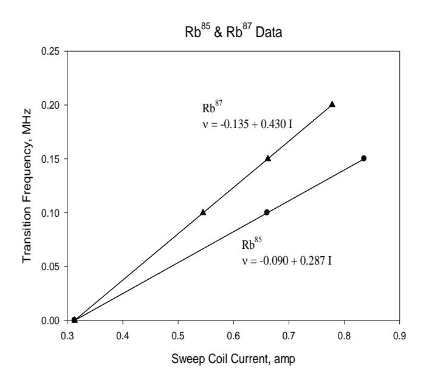

The slopes of the two plots are in the ratio of 0.430/0.287 which gives a value of 1.498. The theoretical ratio is 1.5.

## **Sweep field calibration**

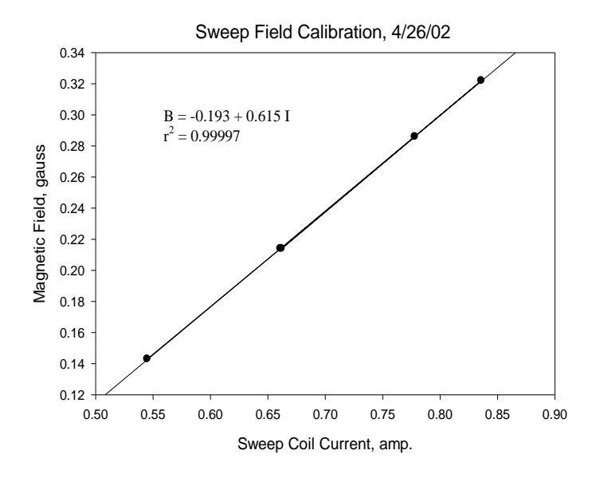

#### **Main field calibration**

| Freq. MHz | Total field, gauss | Sweep current, amp | Main current, amp | B from sweep coils, gauss | B from main coils, gauss | Isotope |
|--------------|--------------------------|--------------------------|-------------------------|---------------------------------------|-----------------------------------|---------|
| 0.2000       | 0.2858                   | 0.321                    | 0.0322                  | 0.0047                                | 0.2811                            | Rb87    |
| 0.2000       | 0.4287                   | 0.316                    | 0.0492                  | 0.0017                                | 0.4270                            | Rb85    |
| 0.3003       | 0.4291                   | 0.306                    | 0.0500                  | -0.0045                               | 0.4336                            | Rb87    |
| 0.3003       | 0.6437                   | 0.313                    | 0.0740                  | -0.0002                               | 0.6439                            | Rb85    |
| 0.4002       | 0.5719                   | 0.197                    | 0.0740                  | -0.0716                               | 0.6435                            | Rb87    |
| 0.4002       | 0.8578                   | 0.662                    | 0.0740                  | 0.2148                                | 0.6430                            | Rb85    |
| 0.5002       | 0.7148                   | 0.205                    | 0.0900                  | -0.0667                               | 0.7815                            | Rb87    |
| 0.5002       | 1.0722                   | 0.785                    | 0.0900                  | 0.2906                                | 0.7816                            | Rb85    |
| 1.0001       | 1.4291                   | 0.121                    | 0.1786                  | -0.1185                               | 1.6482                            | Rb87    |

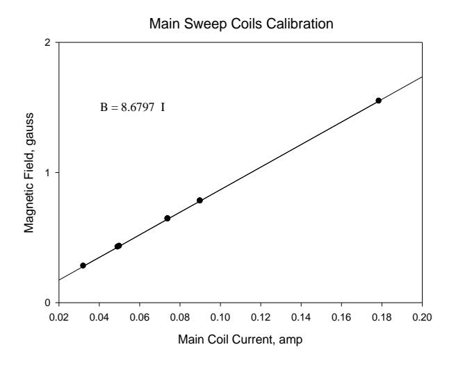

# 4C. Quadratic Zeeman effect

The RF resonances of both isotopes will now be studied as the applied magnetic field is increased into a region where the energy level splitting is no longer linear in **B**. Each of the zero field energy levels splits into 2F + 1 sublevels, whose spacing is no longer equal. In this region there are 2F resonances whose splittings can be resolved . Thus for I = 3/2 there are a total of six resonances with ΔF = 0 and ΔM = ±1, and for I = 5/2 a total of ten. These can all be observed. Their relative intensities depend on the pumping conditions.

The magnetic field at which these resonances can be observed can be approximately determined from the resonance equation

$$v = g_F \mu_0 B / h \qquad 2F-2$$

and the current for the main field coils set from the previous calibration.

Start with the main field current at zero, and set the sweep current to the center of the zero field transition. Then set the main field current to the desired value, and use the sweep field to observe the resonances. For a given frequency, measure the sweep field current corresponding to each resonance, and calculate the total magnetic field. If the first frequency that you try does not yield resolved resonances go to a higher frequency.

#### **SAMPLE DATA**

**Rb87** : Front Panel settings: Output gain = 20 X 10

ν = 4.9874 MHz

RC = 100 msec

RF amp gain = 3 on dial

Sweep time = 100 sec

Main field current = 0.820 ampere

Main field = 7.117 gauss

The observed spectrum is shown in Figure 4C-1 and the calculated spectrum from the Breit-Rabi equation is shown in Figure 4C-2.

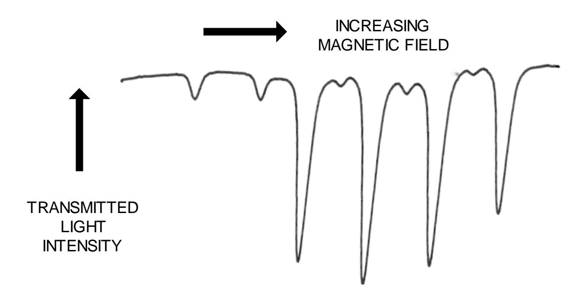

Figure 4C-1. Observed spectrum of Rb87at optimum RF power.

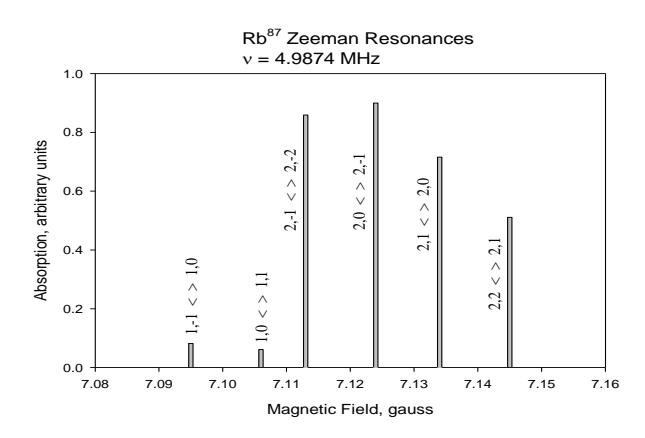

Figure 4C-2. Calculated spectrum of Rb87 .

The absorption intensities in Figure 4C-2 have been adjusted to match the observed spectrum. The Breit-Rabi equation can not be directly solved for x and hence B, but it can be easily solved by a computer program such as Maple or Mathmatica. The results in Figure 4C-2 were obtained using Maple 5.

The resonances occur at fields shown in the following table:

| Sweep Field Current | Sweep Field | Total Field from   | Total Field from |
|---------------------|-------------|--------------------|------------------|
| amperes             | gauss       | calibration, gauss | BR eqn., gauss   |
|                     |             |                    |                  |
| 0.292               | -0.013      | 7.104              | 7.095            |
|                     |             |                    |                  |
| 0.310               | -0.002      | 7.115              | 7.106            |
|                     |             |                    |                  |
| 0.321               | 0.004       | 7.121              | 7.113            |
|                     |             |                    |                  |
| 0.339               | 0.016       | 7.133              | 7.124            |
|                     |             |                    |                  |
| 0.355               | 0.025       | 7.142              | 7.134            |
|                     |             |                    |                  |
| 0.373               | 0.036       | 7.153              | 7.145            |
|                     |             |                    |                  |

There is a systematic difference of 0.009 gauss or about 0.14% between the calculated and measured total field values.

The Rb87 spectrum taken under the same conditions as above except at higher RF power is shown in Figure 4C-3. Here the double quantum transitions, which occur midway between the single quantum transitions, are shown. Notice that the single quantum transitions have become broader because they are being overdriven by the higher RF power.

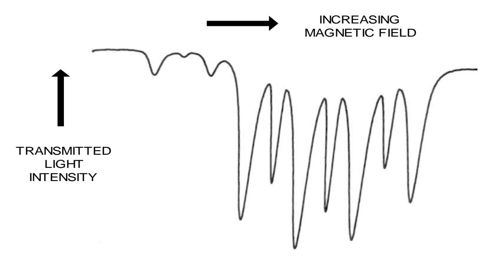

Figure 4C-3. Observed spectrum of Rb87 at higher RF power showing double quantum transitions.

Now we will look at some sample date for Rb85.

 $\mathbf{Rb}^{85}$ : Front Panel settings: Output gain =  $20 \times 10$ 

v = 3.3391 MHz

RC = 100 msec

RF amp gain = 3 on dial

Sweep time = 100 secs Main field current = 0.820 amp

Main field = 7.117 gauss

INCREASING MAGNETIC FIELD

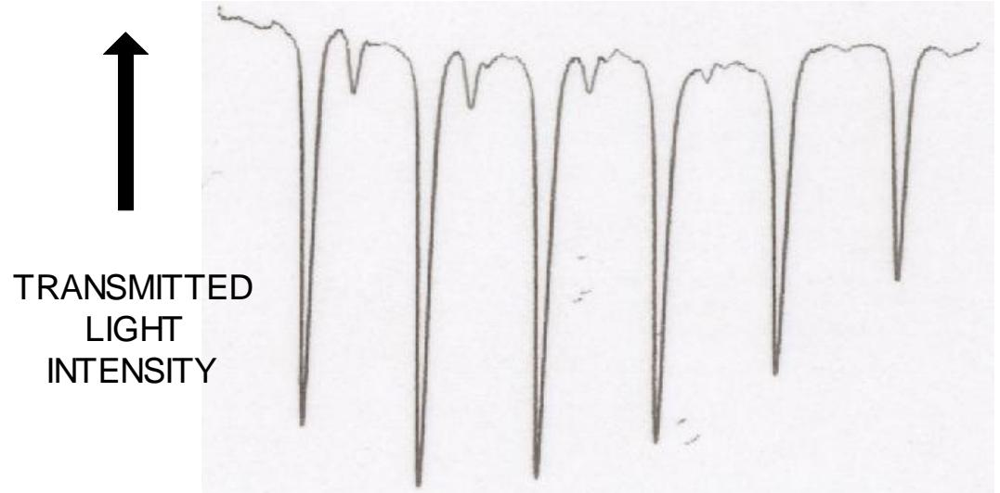

Figure 4C-4. Observed spectrum of Rb85 at optimum RF power.

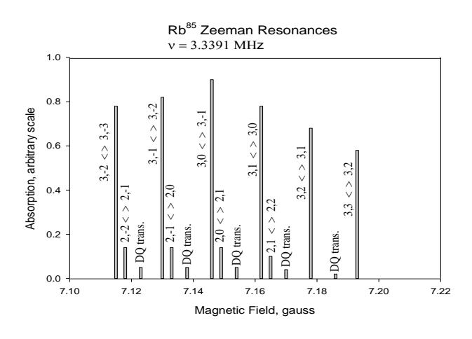

Figure 4C-5. Calculated spectrum of Rb85.

The resonances occur at fields shown in the following table:

| Sweep Field Current, amp | Sweep Field, gauss | Total Field from calibration, gauss | Total Field from BR eqn., gauss |
|-----------------------------|--------------------|----------------------------------------|------------------------------------|
| 0.318 amp                   | 0.003              | 7.120                                  | 7.115                              |
| 0.344                       | 0.019              | 7.136                                  | 7.130                              |
| 0.369                       | 0.034              | 7.151                                  | 7.146                              |
| 0.395                       | 0.050              | 7.167                                  | 7.162                              |
| 0.421                       | 0.066              | 7.183                                  | 7.178                              |
| 0.446                       | 0.081              | 7.198                                  | 7.193                              |

There is a systematic difference of 0.005 gauss or about 0.07% between the calculated and measured total field values.

The Rb85 spectrum taken under the same conditions as above except at higher RF power is shown in Figure 4C-6. Here the double quantum transitions, which occur midway between the single quantum transitions, are shown. Notice that the single quantum transitions have become broader because they are being overdriven by the higher RF power.

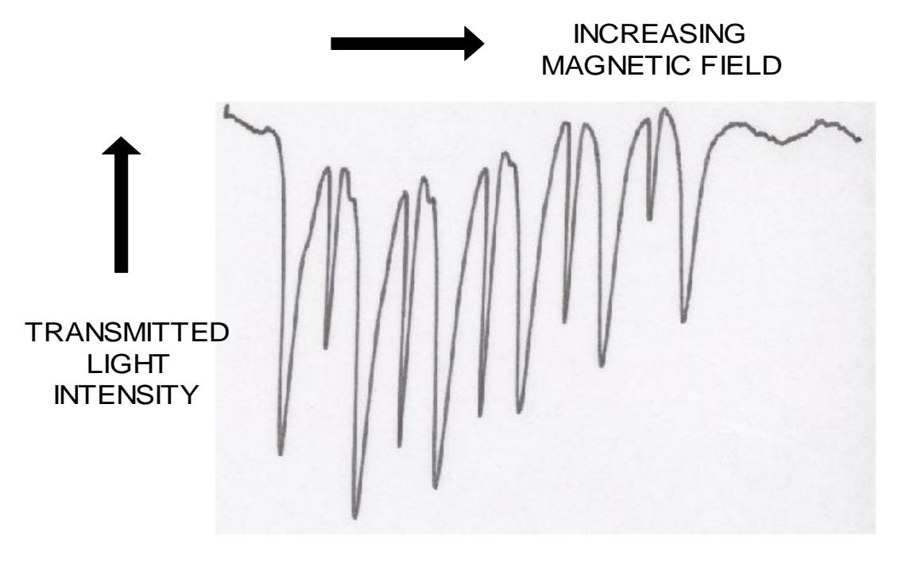

Figure 4C-6. Observed spectrum of Rb87at higher RF power showing double quantum transitions

# 4D. Transient Effects

In order to observe transient effects it is necessary to either turn the pumping light off and on rapidly or turn the RF on and off while tuned to the center of a resonance. Here we will do the latter while tuned to the center of a low field resonance, and observe the transmitted light intensity as a function of time.

#### **SAMPLE DATA**

A square wave pulse of about 0 to +5 volts amplitude is connected to the RF modulation input on the front panel, and the frequency of the square wave set to about 5 Hz. The falling edge of the square wave should be used to trigger the sweep of a storage scope, and the output of the detector monitored. The following data was taken at a resonance was taken at a resonance frequency of 0.3 MHz. The RF amplitude was taken as the voltage across the 50 ohm resistor in series with the RF coil. A typical result is shown in Figure 4D-1. The upper trace shows the waveform that is gating the RF, and the lower shows the resulting optical signal.

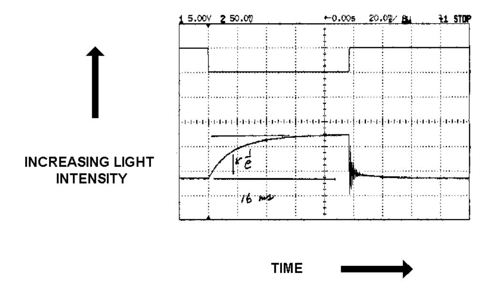

Figure 4D-1. Time dependence of the transmitted light intensity vs. RF amplitude.

When the RF is on all of the Zeeman levels are mixed, no optical pumping takes place, and the transmitted light intensity is a minimum. Turning off the RF allows pumping to begin, and the light intensity increases exponentially until a maximum value is reached. The time constant of this exponential is a measure of the optical pumping time. The characteristic value of the time will be found to be proportional to the intensity of the pumping light.

When the RF is turned on transitions will occur between the Zeeman sublevels and the population of the levels will be driven toward equilibrium. If the rise time of the RF envelope is short enough the populations will overshoot giving rise to the ringing shown in Figure 4D-1. The ringing damps out, and the light intensity approaches that for the unpumped cell.

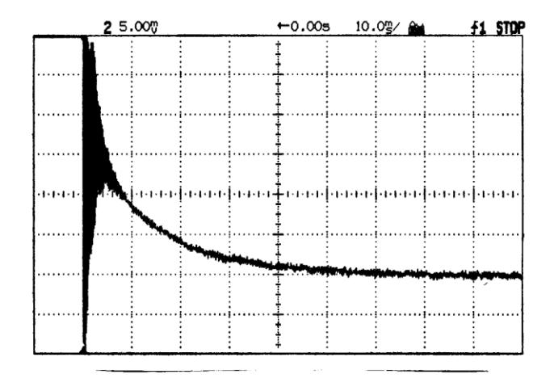

Figure 4D-2. Expanded region where the RF is turned on.

Figure 4D-2 shows an expanded region of Figure 4D-1 in the region of where the RF is turned on. It can be seen that the ringing is damped out followed by a longer damping time before the light returns to the unpumped value.

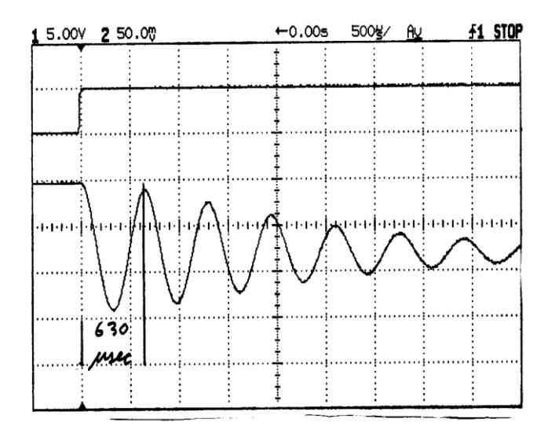

Figure 4D-3. Expanded region where the RF is turned on.

Further expansion of the region around the RF turn on time yields a result shown in Figure 4D-3. Here the ringing can be clearly be seen, and its period measured. According to the earlier discussion this period should be linearly proportional to the reciprocal of the amplitude of the RF, since it corresponds to a precession of **F** about the RF magnetic field. Figure 4D-4 shows this to be the case for both isotopes where the fit has been done by regression analysis in SigmaPlot.

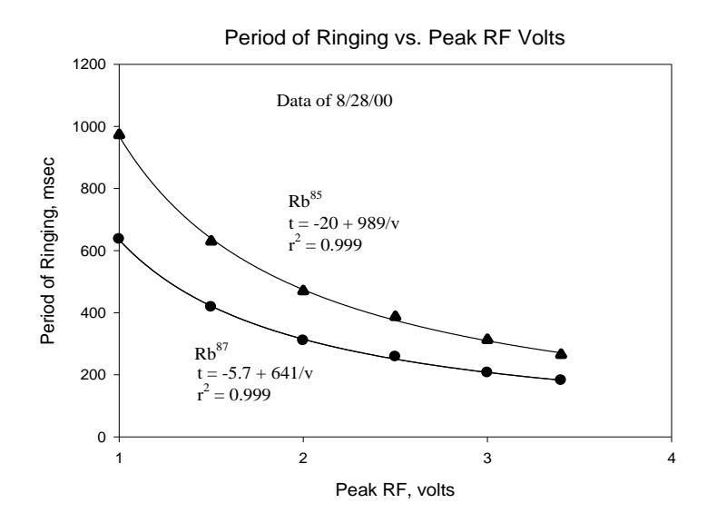

Figure 4D-4. Period of ringing vs. peak RF volts.

At a given value of the RF magnetic field the ratio of the periods of the ringing goes inversely as the  $g_F$  factors, and the above data shows that this ratio is 989/641 = 1.54 to be compared with a theoretical value of 1.50.

# Section 5

# 5. Getting Started

**a.)** Before unpacking the optical pumping apparatus you will need to find a good place to set up your instrument.

**Magnetic Environment**: You need a location with relatively uniform DC magnetic fields. It should be well away (several feet) from any iron (steel tables, shelves, radiators etc.) or other magnetic material. You will also need to align the optical axis of the instrument along the horizontal component of the Earth's Magnetic field. You will also need a non-magnetic table on which to place the instrument. AC Magnetic fields at the power line frequency (50/60 Hz.) will also affect the performance of the instrument. AC magnetic fields are believed to limit the low field line width, and large AC fields can lead to strange line shapes.

**Room lights**: It is useful (though not essential) to be able to dim or turn off the room lights during some of the optical alignment. TeachSpin does provide a black cloth to cover the optics while taking data, however a little stray light always does seem to get into the detector. This can be particularly annoying when there are large changes in the ambient light level.

**Thermal Environment**: DC drifts in the signal level are due in large part to temperature changes in the lamp and experimental cell. Though both the lamp and cell are in regulated ovens, changes in the ambient temperature will invariably lead to drifts in the signal level.

- **b.)** Once you have selected a site for your instrument, remove it from the box. Place the experiment platform on the table and align the optical axis with the Earth's magnetic field. (you will need a compass for this). Place the Electronics box several feet away from the experiment platform. (AC magnetic fields from the power supply transforms will affect the line widths)
- **c.)** Before you start to place the optics on the rail, you will need to remove two pieces of shipping foam from inside the cell oven. With a small flat blade screw driver remove the three screws that hold the end caps onto each end of the cell oven. Place the end caps aside. Inside each side of the cell oven you will see a white doughnut shaped (annulus) piece of foam insulation and a black piece of shipping foam. Leave the white doughnut pieces in place. Remove the black shipping foam piece from each side of the oven.

On one side of the oven you will see the thermocouple temperature sensor covered with black heat shrink tubing. The Thermocouple wire is only 5 µm in diameter and very delicate. In the center of the oven you will see the experimental cell held in place by a white foam support. You should confirm that the cell is still in the center of the oven. If you need to move the cell push gently on the foam support, make sure that the cylindrical cell does not become tilted in the support. If for some reason you need to replace or change the cell, remove the cell and the foam support together. *Push gently from the side with the thermocouple towards the side without the thermocouple. Once the cell is properly placed in the center of the oven, make sure that the thermocouple is touching or at least close to the experimental cell.* For an accurate measure of the cell temperature you do not want the thermocouple to be touching the heater element. Now replace the white doughnut shaped foam pieces of insulation and then the end caps.

If you think you would find it easier to work on the cell oven if it was not between the magnet coils, you may remove the cell oven as follows: Remove the black anodized (1/2" diameter 5.94" long) spacer from the top of the Horizontal magnet coils. It is held in place by two ¼-20 brass screws. Remove the cable tie downs from the wooden base, so that you can get some slack in the heater and RF cables. Loosen the nylon screws that hold the Cell Oven to the optical rail and then remove the Cell Oven from between the magnet coils. Be careful feeding the cable between the coils. Follow these steps in reverse to put the Cell Oven back on the rail.

- **d.**) **Placing Optics:** Note that the magnet coils are not located in the center (wrt length) of the optical rail. The long part of the optical rail is for the Lamp and its associated optics. The experimental cell is centered 3.5" above the optical rail. (See Figure 3D-1) in Apparatus)
  - 1) Place the Lamp near the end of the long section of optical rail. Adjust the height of the lamp such that the bulb is centered  $3.5''^2$  above the rail.
  - 2) Place the 50 mm plano-convex lens after the lamp, with the flat side facing the lamp and with the distance between the lamp bulb and the center of the lens equal to about 50 mm.(This placement is not crucial and we will adjust the lens position for maximum signal later)
  - 3) Place the Interference filter with the reflecting side towards the lamp.
  - 4) Place the Linear Polarizer after the interference filter with axis of the polarizer at 45° (The alignment mark on the holder indicates the direction of the axis).
  - 5) Adjust the ¼ wave plate so that its axis is at 0° and place it after the Linear Polarizer.
  - 6) On the other side of the Magnet coils place the remaining plano-convex lens (curved side towards the cell) and then the detector. Set the height of the detector so that the diode is centered 3.5" above the rail.

\_

&lt;sup>1 The heater element is the glass cylinder in which the cell and its foam support slide.

&lt;sup>2 A standard business card is 3.5" in length which we use for quick alignment.

- **e.) Connect the Electronics**. You now need to make the following connections.
  - 1) Plug Lamp power into back panel connector
  - 2) Plug blue Thermocouple into lower front panel and blue heater banana plugs.
  - 3) Plug Black plastic Pre-amp power and Detector BNC into lower front panel.
  - 4) Plug in Vertical Field banana plugs into lower front panel. (red plug in red jack)3
  - 5) Plug the Horizontal Sweep Field banana plugs into the lower front panel. The horizontal fields are wired such that if the red plug is in the red jack the field will point in the direction of the light, (from the lamp to the detector). If you have oriented the experimental platform such that the lamp is on the south end then put the red plug in the red jack. Do not worry about this too much. Simply plug it in and, if you don't see the zero field transition, then reverse the plugs. At this point you do not have to connect the Horizontal field*. If you do connect it make sure that the current is set to zero*

Turn on the power switch on the back panel power entry module. After a few seconds of setup the temperature regulator will display the cell temperature. Check that the set point of the regulator is 50° C. Push the SCROLL key twice. SP will be displayed for 1.5 seconds and then the value of the set point will be displayed. If the value is not 50° C then push the UP or DOWN keys till it is. Push the SCROLL key twice again. PROC will be displayed for 1.5 seconds and then the current temperature. If you have questions please refer to the Temperature section of the Apparatus or the controller manual.

- **f.)** The lamp should turn on after a few minutes of warm up. You will see a purplish pinkish glow. The Lamp and the Cell Oven will take 10-20 minutes to thermally stabilize.
- **g.)** Optical alignment. You will now adjust the optics for a maximum signal. It is best if you turn off the room lights for this alignment, but leave enough light so that you can see what you are doing and also observe the detector meter. Set the preamp gain for 10 MΩ (toggle switch on preamp in middle position). On the Detector Amplifier set the Gain = 1, Gain Mult. = x1, Time Constant = 100 ms, Meter Multiplier = x1, and DC Offset = 0. There should be a signal on the meter. Use a card to block the lamp and make sure this signal is from the lamp and not the room lights. If the signal is off scale change the meter multiplier to x2. If the signal is still off scale then you are probably saturating the preamp and you will need to change the preamp gain to 3 MΩ (toggle switch in up position).
- **h.)** You have set the Detector and Lamp height equal to the experimental Cell height. Maximizing the optical signal is now only a matter of adjusting the height of the two lenses and the spacing between the first lens and the Lamp and the second lens and the Detector. Loosen the nylon thumb screw on the side of the optical carriers to move the lenses along the optical rail. Loosen the nylon thumb screw on the side of the support

3 This assumes you live in the Northern Hemisphere.

Rev 1.1 2/09

holder to adjust the height of the lenses. Watch the meter on the Detector Amplifier while you do this and maximize the signal. If you are a perfectionist you can use the gain and DC offset control to zoom in on the maximum signal. The Lamp bulb is not always perfectly centered over the optical rail and you may find that slightly rotating the first lens about the vertical axis will steer the beam back to the center of the Cell and give you a little more signal.

**i.)** Zero Field Transition. Having maximized the DC signal, we are now ready to find the zero field signal. The purpose is to adjust the horizontal and vertical coils so that the magnetic field at the cell is zero. We take care of the third component of the local field by aligning the instrument so that the axis is parallel with the local field.

It is very useful (though not necessary) to have an X-Y storage oscilloscope for this experiment. Make sure that there is no RF on the RF coils by unplugging the coils from the RF amplifier. Make sure the main Horizontal filed is either set to zero or unplugged. Cover the optics with the black cloth. Adjust the DC offset so that the meter reads zero and turn up the gain to 20. You can adjust the gain as necessary if you have too much or too little signal. You may also have to adjust the DC offset if the signal drifts out of range.

We find that the cell can take along time to thermally equilibrate within the oven. The simple act of placing the cloth over the instrument is enough to temporarily change the temperature and cause a DC drift. Using a compass approximately align the instrument with the local field. Set the vertical field current to 0.33 A (3.3 on the dial).4 If you are using a X-Y storage scope attach the Y axis to the Detector output and the X-axis to the Horizontal Sweep field Recorder Output and turn the Recorder offset to zero (full CCW). Set the Y-axis gain to 0.5 V/div and the X-axis to 1.0 V/div. Make sure that both inputs are DC coupled. Now on the Horizontal Sweep Field control put the Start/Reset toggle to Reset and starting from zero slowly increase the horizontal sweep field by turning the Start Field potentiometer.

You expect to see a broad dip in the transmitted light signal. In Buffalo, NY this dip is centered at a current of about 0.3 Amperes (Dial reading of 3.0). If you see no dip, try reversing the polarity of the Horizontal Sweep field (reverse the banana plugs). Then try changing the Vertical field. Turn the potentiometer one turn and try sweeping the horizontal field again. It is not inconceivable (if you are in a building with a lot of steel) that the local vertical field is in the opposite direction, try reversing the polarity of the vertical field. If all else fails do not hesitate to contact TeachSpin. We will be happy to help you.

4 This is the approximate setting to cancel the vertical component of the Earth's Field in Buffalo, NY. USA. If you are further north you may need to a larger current and further south a smaller current. Of course it is really the local field that you must cancel out and the building you are in may make much more of a difference than your latitude.

Rev 1.1 2/09

**j.)** Once you have found the dip, you will adjust the vertical field and position of the experimental platform for a minimum width. The easiest way to do this is to adjust the field to the side of the dip (using the Start Field control) and then adjusting both the vertical field and the angle platform for a maximum signal.5 You will have to adjust the oscilloscope gain and offsets during this iterative process. For the X-axis offset you can use the recorder offset On the Horizontal Field Sweep control to keep the signal centered.

When you have finally finished aligning the magnetic fields you should find that the zero field transition corresponds to an intensity change of about 2% of the DC signal and that it has a line width of about 3 mG (30 µT) (The gain of the recorder output has been set so that 50mV ≈ 1 mG (10 µT).

You are now ready to do other experiments described in section 4.

5 There might be some confusion about what is meant by maximum signal. When you sweep through the zero field signal the dip corresponds to less light getting to the detector. This is a minimum signal. When sitting on the side of the dip and looking for a maximum signal, that is more light going to the detector.